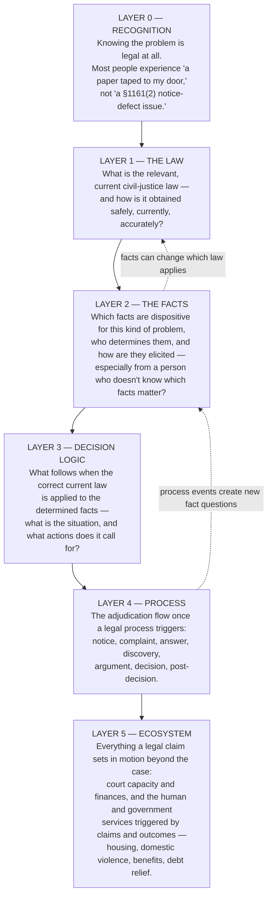

# The Access-to-Justice Stack: What CJaC Addresses, What It Doesn't, and Why

*Every serious project owes its readers a scope statement: not just what it does, but what it deliberately does not do, and the reasoning behind the line. This document places Civil Justice as Code in the context of the full American access-to-justice problem — which is far larger than any single project — and defines precisely which layers of that problem CJaC addresses, which it is expanding into by designed experiment, and which it will never claim. Companion documents: `OPEN_QUESTIONS_AND_LIMITATIONS.md` (what remains unproven) and `CJAC_ROADMAP.md` (the sequencing).*

**Status:** final · authored 2026-07-24, adopted as the README's front-door document 2026-08-25 (Andy confirmed final upon review)

---

## 1. The gap, briefly

Up to 30 million lower- and middle-income Americans face civil legal problems — evictions, debt collection, benefits denials, family matters — without a lawyer, because they can't afford one. Legal aid reaches a fraction of the documented need. And the problems cascade: a denial of benefits can lead to unpaid bills, then a collection case and default judgment, then credit damage, then eviction. The gap is not a single failure; it is a failure that occurs at every layer of a stack — and different layers need different fixes, from different actors. Naming the layers is the first step to being honest about which ones any one project can touch.

## 2. The A2J stack

A person's path through a civil legal problem passes through six layers. Real problems loop and branch rather than flowing cleanly — a fact determined at layer 2 can change which law applies at layer 1 — but the layers are distinct kinds of work, and they fail in distinct ways.

One observation about Layer 0 matters enormously for everything below it: **AI chat is the first mass channel that meets people at Layer 0.** People describe problems to AI assistants in plain language — "can my landlord do this?" — before knowing the problem is legal, at the moment it is happening, at no cost. No prior legal-help channel (hotlines, websites, self-help centers) has ever operated at that layer at scale. That is the strategic fact underneath this entire project: the channel that reaches people already exists and is already being used; the question is whether what it tells them is safe.

## 3. CJaC's footprint on the stack

CJaC's scope has two dimensions: *which layers* it addresses (the stack above) and *how deep into subjective law* it goes at each layer (the Band 1/2/3 gradient defined in `CJAC_ROADMAP.md`: Band 1 — deterministic rules with freezable outcomes; Band 2 — judgment questions with deterministic legal *structure*: elements, burdens, presumptions, evidence checklists; Band 3 — genuine discretion, where the only honest encoding is the boundary marker itself).

| Layer | Band 1 (deterministic) | Band 2 (structured-subjective) | Band 3 (discretionary) |
|---|---|---|---|
| **0 — Recognition** | *Served by the channel, not by CJaC* — the AI interface meets people here; CJaC makes what it says next safe | — | — |
| **1 — The Law** | ✅ **CORE, validated** — looked up from current sources, encoded, attorney-ratified, freshness-monitored | 🔶 **Frontier (x)** — encoding legal *structure* (e.g., §1942.5 retaliation elements + 180-day presumption); Proof 3 designed | ⛔ Boundary markers only, ever |
| **2 — The Facts** | ✅ **CORE, validated** — completeness checklists enumerate the dispositive facts per rule | 🔶 **Frontier (y)** — checklist-driven *elicitation* from imprecise nonlawyer input; the lower-bound test track (Direction E) | ⛔ Credibility and disputed-fact resolution are human work |
| **3 — Decision Logic** | ✅ **CORE, validated** — the encoded rules themselves: facts + current law → situation + required actions | 🔶 Follows the Layer-1 frontier: structure in, outcome-prediction never | ⛔ Never |
| **4 — Process** | ✅ **Partial, expanding** — the deterministic spine: answer deadlines, filing requirements, service rules, sequence ("what to file, by when") | 🔶 Later (procedural judgment calls: what to argue) | ⛔ Strategy and advocacy are human work |
| **5 — Ecosystem** | ⛔ **Out of scope, permanently** — court capacity, funding, service delivery are institutional problems CJaC can inform but not solve | ⛔ | ⛔ |

The two 🔶 frontier edges are not incidental — they are the project's two hardest open questions, and they are documented as such: the Band 2 depth question is `OPEN_QUESTIONS_AND_LIMITATIONS.md` #10, and the elicitation question is #1. A fact worth stating plainly: **both frontiers are served by the same machinery.** The completeness checklist — the enumeration of which facts each rule requires — is simultaneously the elicitation engine for Layer 2 (the system knows what to ask because it knows what it doesn't know) and the process-correctness skeleton for Band 2 (elements and burdens are, structurally, a completeness checklist for a judgment question). CJaC's two hardest problems share one answer under construction, and the tests for both are specified (Direction E; Proof 3).

## 4. Why this slice — four reasons

**It is the layer the new infrastructure just made scalable.** As of 2026, the major AI platforms offer plugins and open marketplaces — a common place and way to build standard, shared legal applications. Layers 1–3 are exactly what that infrastructure can carry: validated legal knowledge, distributed at the marginal cost of software, inside the interface people already use. No comparable distribution mechanism exists for the other layers.

**It is the layer that is *validatable*.** You can hash-verify an encoded rule, freeze ground truth for it, score it, publish the provenance, and put a named attorney's signature on it. You cannot hash-verify a court's docket capacity or a county's housing-services funding. CJaC's entire method — validation as the product — only works on layers whose correctness is checkable. We chose the layers where trust can be *manufactured and demonstrated*, not merely asserted.

**It is the trust bottleneck for everything downstream.** Every effort at the other layers — court simplification, self-help centers, legal-aid triage, right-to-counsel implementation — consumes legal information as an input. When that input is wrong, everything downstream inherits the error. Making Layers 1–3 accurate, current, and free raises the floor for the whole stack, including the layers CJaC does not touch.

**It compounds with model progress instead of racing it.** Every improvement in frontier models makes this slice cheaper to build, better validated, and easier to distribute. A project positioned at Layers 1–3 rides the AI improvement curve; a project that bet on models' unaided legal judgment would be racing it.

## 5. What CJaC is not — and who does the rest

CJaC is not a court-reform project, a funding solution, a representation program, or a legal-advice service. Layer 5 — court capacity and finances, the services triggered by legal outcomes, the policy questions of right to counsel — belongs to institutions, legislatures, and movements, not to code. Band 3 — genuine judgment, strategy, advocacy, credibility — belongs to humans, permanently; CJaC encodes that boundary rather than crossing it. And nothing CJaC produces is legal advice: it is legal *information*, the kind legal-aid organizations routinely publish, with anything case-specific requiring a human in the loop.

The ecosystem doing the rest deserves naming, because CJaC is designed as *complementary infrastructure* to it, not a substitute for any of it: right-to-counsel campaigns and their implementation; court simplification, plain-language forms, and online dispute resolution; regulatory reform experiments broadening who may deliver legal help; the legal-aid organizations who are the system's working core; the **Legal Help Commons** and **JusticeBench** (Stanford Legal Design Lab) — the field's shared-infrastructure and cataloguing effort, with which CJaC is aligned: CJaC's validated decision logic is a natural content category for the Commons' knowledge-base layer, conforming to its trust standards (jurisdiction, provenance, license, citation), and CJaC's validation methodology is offered as input to the Commons' evaluation rubrics — the two efforts are parallel distribution paths sharing the same base layer; and the rules-as-code programs abroad (France, New Zealand, Germany, Australia) whose lineage CJaC extends. Each of these efforts consumes accurate legal information; CJaC's aim is to be the validated, free, standard source of it. If the choice were between funding CJaC and funding a lawyer for a family facing eviction, the lawyer wins — the point of CJaC is that this is not the choice: validated legal infrastructure is cheap, reusable, and makes every one of those efforts more effective.

## 6. The delivery plan — and why it is staged the way it is

CJaC's program, in one paragraph: **(i)** collect, validate, and continuously maintain accurate A2J law across US jurisdictions — attorney-ratified, hash-verified, freshness-monitored; **(ii)** publish it into the common AI-platform infrastructure as open-source legal plugins, driving standardization and continuous improvement instead of fifty agencies separately building the same thing; **(iii)** deliver it ethically to the people who need free legal help — in two deliberate stages.

**Stage one — agencies, with a zero-IT design requirement.** Legal-aid organizations and courts have no engineering staff, and any solution that requires integration work will not be adopted. The plugin is therefore designed to require *nothing technical*: it works inside the AI interface staff already have. In this stage, trained staff are the Layer-2 fact-extraction layer — which is not a compromise but correct sequencing: the elicitation frontier (Section 3) is unvalidated, and until it is tested, a trained intermediary belongs between the system and the client. The first mediated deployment pilot is designed (`PILOT_DESIGN_BAYLEGAL_DRAFT.md`) with pre-registered endpoints and stop criteria.

**Stage two — consumer-ready, only behind gates.** Direct public availability — anyone asking an AI assistant about an eviction notice and receiving validated, current, jurisdiction-correct legal information — is the mission's full expression, and it is gated, not assumed: it requires the interactive elicitation testing (Direction E Tier 2) to demonstrate lower-bound safety, formal legal-ethics review of the information/advice line under interactive use, per-platform integration testing, and platform partnership for default availability. Those gates are specified in the roadmap. Reaching stage two responsibly is the reason the AI model companies are among the project's first conversations: consumer-scale delivery runs through their platforms, and the trust layer that makes it responsible is precisely what CJaC builds.

## 7. Reading further

`CJAC_ROADMAP.md` — the two-axis progression (jurisdictions and practice areas × bands) with phases and gates · `OPEN_QUESTIONS_AND_LIMITATIONS.md` — the eleven things we haven't proven, each with its planned test · the validation ledger and errata record — the receipts.

---

*This framework will be iterated. If the stack is missing a layer, or the footprint claims too much or too little, open an issue — the scope statement is subject to the same correction discipline as the code.*

*Copyright 2026 Andrew M Cohen. Apache 2.0.*
