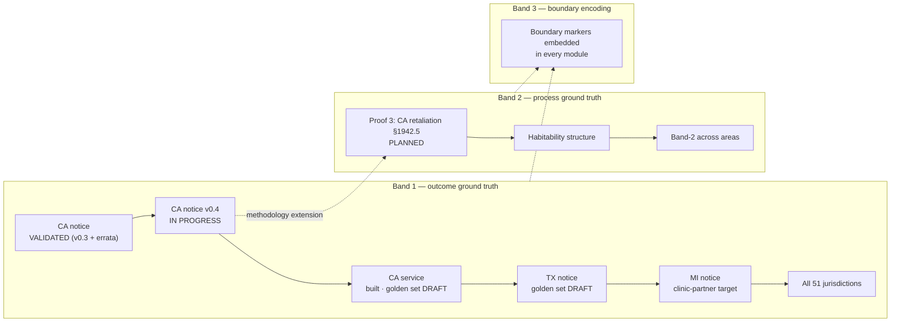
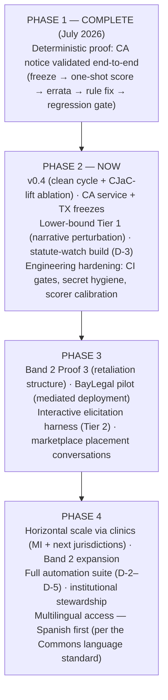

# CJaC Roadmap — Two Dimensions: Breadth and Depth

**Status date:** 2026-07-24 · Companion to `OPEN_QUESTIONS_AND_LIMITATIONS.md` (which states what's unproven) and `DIRECTION_D_ROADMAP.md` / Direction E specs (which define the engineering programs). This document is the strategic map: what gets encoded, in what order, and how "validated" is defined at each step.

---

## The two axes

CJaC expands along two axes at once, and they are not the same kind of hard:

- **Breadth (horizontal):** more jurisdictions and more practice areas — CA → TX → MI → all 51; eviction notice → service → other eviction defenses → debt → benefits → family law. Breadth is a *capacity* problem: the method repeats; the constraint is attorney review capacity per jurisdiction (see the automation-leverage program: the tracked goal is driving attorney-minutes-per-validated-rule low enough that part-time volunteer review suffices).
- **Depth (vertical):** down the determinism gradient — from rules with freezable outcomes into law whose *structure* is deterministic even where its *application* is judgment. Depth is a *methodology* problem: each band requires its own definition of ground truth.

Progress on one axis is not progress on the other, and the roadmap tracks them separately so neither hides behind the other.

## The band taxonomy (depth axis)

| Band | What it is | Examples (eviction) | What ground truth means | Status |
|---|---|---|---|---|
| **1 — Deterministic** | Rules with objectively correct outcomes | Notice periods, court-day counts, service methods, mandatory notice contents, statutory thresholds (§1946.1(b)/(c), §1161(2), §1162, AB 1482 attachment/exemptions) | **Outcome-correctness:** attorney-frozen fact patterns with frozen outcomes, scored one-shot, burned after use | **Proven** (Proof 1, July 2026) |
| **2 — Structured-subjective** | Judgment questions with deterministic legal structure | Habitability (elements, burdens), retaliation (§1942.5 elements + 180-day presumption + burden-shifting), waiver | **Process-correctness:** did the system identify the correct elements, burdens, presumptions, and evidence checklist — and *refuse to predict the outcome*? Abstention scored as correctness | **Hypothesis** — Proof 3 designed (below) |
| **3 — Discretionary** | Genuine judgment: no encodable answer | Relief from forfeiture, credibility, judicial discretion, settlement strategy | **Boundary-correctness only:** the encoding marks the limit ("judgment call; factors courts weigh; human required"). Never more | **Permanent boundary** — encoded as such, never crossed |

The band structure is also the safety architecture: Band 1 answers, Band 2 structures, Band 3 warns. A user is never given a Band 1-style answer to a Band 2 or 3 question — the exclusion discipline from the v0.3 freeze (open-textured items excluded rather than guessed) is what this generalizes.

## The map

## Status matrix (breadth × depth)

| Module / area | Jurisdictions | Band 1 | Band 2 | Band 3 boundary |
|---|---|---|---|---|
| Eviction — notice | CA validated; TX draft | **VALIDATED** (CA, v0.3+errata; v0.4 in progress) | — | Encoded via exclusions |
| Eviction — service | Rules built, 51 states | Golden set DRAFT (CA ×15) | — | Planned |
| Eviction — retaliation | Multi-state holdings corpus collected (Direction A) | n/a (Band 2 native) | **Proof 3 target** (§1942.5 CA) | Planned with Proof 3 |
| Eviction — habitability | — | n/a (Band 2 native) | After Proof 3 | With encoding |
| Debt / benefits / family | — | ROADMAP (post-eviction proof) | ROADMAP | ROADMAP |

*Vocabulary: VALIDATED = held-out scored under the freeze discipline · DRAFT = golden set exists, unfrozen · PLANNED = designed with a gate · ROADMAP = sequenced, undesigned. Every validated module carries a "last verified" date and freshness SLA; modules that cannot be maintained to SLA are decommissioned, not left standing.*

## Gates (what must be true before each step)

1. **v0.4 before anything else** — the clean-cycle score plus the CJaC-lift ablation are the current line; nothing preempts it.
2. **Proof 3 (Band 2) requires:** v0.4 complete; the process-correctness ground-truth spec drafted and attorney-approved (what "correct structure + correct abstention" means, item by item); seed corpus from the retaliation-elements holdings triaged. Expect higher attorney-minutes per item than Band 1 — that is the point of the automation-leverage program, and Band 2 encoding is the clinic partnership's best pedagogy.
3. **Pilot (mediated deployment) requires:** v0.4 record, lower-bound Tier 1 results, initial ethics review — per `PILOT_DESIGN_BAYLEGAL_DRAFT.md`.
4. **Public-facing interactive use requires:** Tier 2 interactive results, formal legal-ethics review, and platform-integration testing. Not before.
5. **Direction C (scale-out) requires:** a score *trend* (two-plus held-out cycles) and a strategic sign-off — unchanged.

## Standing principles (apply to every cell of the matrix)

Named-attorney ratification at every freeze and every rule change · held-out sets burned after one use · dual-reporting wherever a corrected score is cited · disagreement is signal, in both directions · abstention is a correct answer · automation maximizes the value of attorney-minutes and never replaces the ratification judgment · the measurement instrument is validated to the same standard as what it measures (calibration suite, CI integrity checks, independent scorer review).

*Copyright 2026 Andrew M Cohen. Apache 2.0.*
