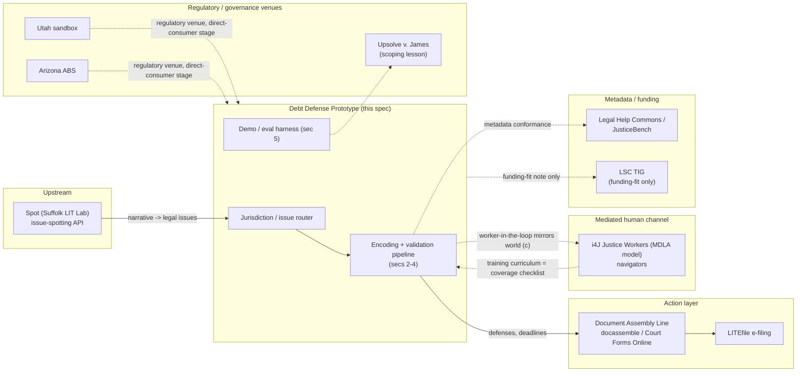

# Debt Defense Prototype — Architecture Spec

**Status:** DRAFT-FOR-ANDY. Not ratified, not built. Task class GREEN — documentation only, per `COWORK_DIRECTION_DEBT_ARCHITECTURE_20260824.md`.
**Prepared:** 2026-08-24.
**Scope of this document:** a specification for Andy's review and decision. It commits no rules files, builds no code, and modifies nothing in the existing eviction line — see the appendix for that line's current, unmodified state.

> **Read this before the sections below.** Two pieces of this spec cannot be written with confidence because their source documents don't exist in the repository yet: the Band 1/2/3 taxonomy (referenced against `CJAC_ROADMAP.md`, which has not been committed or supplied) and the AMPVR metric and Direction E Tier 2 harness design (referenced against the Direction E directive, also not committed or supplied — both are still sitting behind the "docs are final" gate from the 2026-07-24 publication checklist, which was never triggered). Wherever this spec uses those terms, it uses the plain-language meaning inferable from how Andy has used them in directives to date (Band 1 = validated/high-confidence, Band 2 = extension/lower-confidence, Band 3 = boundary marker between determination and judgment; AMPVR = some accuracy/reliability composite, name and formula unknown) and flags the gap inline. **Do not treat those sections as final** — they need reconciliation against the actual roadmap and Direction E text once those exist. Everything else in this spec is either sourced (cited inline) or explicitly marked as this document's own proposal for Andy's ratification.

---

## Why debt (the wedge)

Debt collection lawsuits are the highest-volume, least-defended civil case type in the state courts that track it, and the underlying law is federally centralized in a way eviction law is not — which is precisely the combination that makes a non-incremental, AI-industrialized validation approach worth testing here first.

The scale and asymmetry are documented by Pew's 2020 study of state civil dockets: debt claims went from roughly 1 in 9 civil cases in 1993 to roughly 1 in 4 by 2013, with the trend continuing in states reporting data since. In the cases Pew studied from 2010–2019, fewer than 10% of defendants had counsel, compared with nearly all plaintiffs. Over the preceding decade, more than 70% of debt collection lawsuits in the jurisdictions with available data ended in default judgment — a judgment entered because the defendant didn't show up or respond, not because a court found the debt valid. All 50 states and DC allow pre- and post-judgment interest on top of that default judgment (Pew, *How Debt Collectors Are Transforming the Business of State Courts*, 2020).

That volume-and-default pattern is exactly what CJaC's eviction-line discipline was built to catch — but debt has a structural advantage eviction doesn't: a strong federal spine. The Fair Debt Collection Practices Act (15 U.S.C. § 1692 *et seq.*) and its implementing Regulation F (12 C.F.R. Part 1006) govern collector conduct and required disclosures in every state; the Fair Credit Reporting Act (15 U.S.C. § 1681 *et seq.*) governs the credit-reporting side of the same disputes. One careful encoding of that spine, plus CFPB official interpretations and consumer guidance and FTC materials, amortizes across all 50 states and DC. What's left to vary by state is comparatively narrow and structured: statutes of limitations by claim type, answer deadlines, garnishment exemption amounts, and service/default-judgment procedure — closer to a lookup table than to the open-textured, jurisdiction-by-jurisdiction drafting the eviction line required. That's the case for building this non-incrementally rather than state-by-state.

---

## 1. Corpus assembly

### Federal spine (one encoding, all jurisdictions)

| Source | What it governs | Citation anchor |
|---|---|---|
| Fair Debt Collection Practices Act | Collector conduct: harassment, false/misleading representations, unfair practices; validation-notice content and timing | 15 U.S.C. § 1692 *et seq.* |
| Regulation F | Implements FDCPA; initial-disclosure content (debt amount, creditor name, dispute rights, original-creditor info), delivery timing (validation notice as first communication, or within 5 days after), communication frequency/channel limits, record-retention (3 years past last collection activity) | 12 C.F.R. Part 1006 |
| Fair Credit Reporting Act | Credit-report dispute process, furnisher obligations, the credit-reporting side of a collection dispute | 15 U.S.C. § 1681 *et seq.* |
| CFPB official interpretations & consumer guides | Regulation F commentary; plain-language guidance on debt validation, disputing a debt, responding to a lawsuit | consumerfinance.gov |
| FTC materials | Consumer-facing debt-collection guidance; enforcement precedent (see §9 on the DoNotPay action as an anti-pattern, not a source of law) | ftc.gov |

### State layer (structured lookup-table variation)

Per state: statute of limitations by claim type (credit card, medical, other consumer debt — SOLs vary meaningfully by claim type within a state, not just by state), answer/response deadline after service, wage-garnishment and bank-account exemption amounts, service-of-process rules, and default-judgment entry procedure. This is the part of the corpus that most resembles the eviction line's per-state notice/service tables, and the same schema pattern (§2 below) should extend to it directly.

### Reuse inventory (harvest with license checks, primary law always controls)

- **CFPB/FTC public consumer materials** — plain-language explanations already vetted by the regulator; useful for the elicitation/explanation layer, not as a substitute for citing the underlying rule.
- **State AG consumer-protection pages** — per-state color on collection practices and how to complain; secondary, needs a license check per page.
- **i4J's Medical Debt Policy Scorecard** — Innovation for Justice (University of Arizona James E. Rogers College of Law + University of Utah David Eccles School of Business) publishes an open-source dataset, interactive map, and report scoring all 50 states across four policy goals (reducing debt incurrence, out-of-court resolution ability, court-navigation openness/efficiency/equity for self-represented debtors, reducing post-judgment consequences). This is a directly reusable, already-open-source state-policy dataset for the medical-debt slice specifically — check the license and cite i4J as the source of record.
- **Statewide legal-help content (Michigan Legal Help, Illinois Legal Aid Online)** — both are established, actively maintained self-help platforms with existing debt-collection-response content (ILAO partners with libraries and courthouses for in-person self-help centers and publishes direct debt-lawsuit-response guidance). Treat as **secondary corroboration only** — useful for cross-checking that our encoding matches what an established legal-help org tells the same user, never as a primary-law source.

Every fact in the corpus carries: **source, pin cite, retrieval date, license.** No exceptions — this is the same discipline `VALIDATED_RESOURCES_REGISTRY.md` already enforces for the eviction line; extend that registry's schema rather than inventing a new one.

---

## 2. Encoding architecture

Extends the existing rules-JSON format (`SCHEMA_V2_DESIGN_SPEC.md` in the eviction line) rather than replacing it. New elements needed:

- **Band tags (1/2/3).** *[Gap-flagged — see the notice at the top of this document.]* Working definition pending `CJAC_ROADMAP.md`: Band 1 = bright-line, machine-determinable (e.g., SOL determination: is the claim past the deadline, yes/no, given a claim type and last-payment date); Band 2 = requires judgment on adequacy or sufficiency (e.g., chain-of-title adequacy — does the assignment chain actually establish the current plaintiff owns the debt); Band 3 = boundary marker where the system should stop generating a determination and instead flag that a strategic, non-legal-determination choice is next (e.g., settle-vs-fight is not a fact to be determined, it's a decision the system should surface options for, not make).
- **Confidence tiers per node.** `VALIDATED` (shipped in an attorney-audited release) / `CORROBORATED` (grounded multi-model consensus, not yet human-audited) / `DRAFT`. Tier travels with the node and must be visible at runtime — every output tells the user which tier produced it, not just the eviction line's file-level status label. This is a meaningful architectural change from the eviction line, where status is a property of the whole rules file; here it needs to be a property of each node, because a debt file will plausibly ship with some nodes VALIDATED (federal spine, attorney-audited) and others still CORROBORATED (a newly-added state's garnishment exemption table) in the same release.
- **Completeness checklists per node (the elicitation engine).** What facts does this node need before it can answer? This is what drives the guided-interview / voice-demo layer in §5 — the checklist *is* the interview script for that node.
- **Consequences-and-next-steps fields.** Never a bare classification. Every determination carries "and here is what to file, by when" — mirroring the eviction line's discipline of pairing a defect finding with what it means for the tenant, but making the next-step field structurally required rather than prose.
- **Jurisdiction resolution as a first-class input.** Every session establishes jurisdiction before any node evaluates — not inferred late. The eviction line resolves this per rules-file-per-state; a national debt product needs jurisdiction resolution to happen once, early, and gate everything downstream.

---

## 3. Validation pipeline (the industrialized model)

This is the central departure from the eviction line's item-by-item ratification model. The eviction line put a named attorney's eyes on every individual rule and every golden-set item before release. That doesn't scale to a whole-topic, all-50-state build. The proposal here is to move the attorney from *item-level* review to *system-level statistical accountability* — auditing whether the pipeline as a whole is trustworthy, not re-deriving every node by hand.

**(a) Grounded corroboration.** Three independent frontier models each derive the node's answer from cited authoritative source text — not from priors. A model that answers correctly but can't point to the specific statutory or regulatory text it derived the answer from does not count. Citations are mechanically verified against live source text (not just checked for existing — checked for actually saying what the model claims). Consensus counts only across grounded derivations; an ungrounded agreement between models is not consensus, it's correlated guessing.

**(b) Adversarial generation.** Models attack each node with edge cases designed to break it — this is Direction D-4's method (standing adversarial self-critique, defined in `DIRECTION_D_ROADMAP.md` for the eviction line) applied as a first-class pipeline stage here rather than a periodic pass.

**(c) Mutation testing.** Deliberately corrupted copies of a rule (flip a subsection reference, change a day count, invert a threshold) must be caught by the eval suite, run against dev sets only — never a burned held-out set. This is the same method proposed as Direction D-6/Eng-Hardening Task 6 for the eviction line's own scorer; here it's a pipeline stage from day one rather than a later-added pilot.

**(d) Disagreement queue.** Every model-vs-model or model-vs-source conflict auto-files with evidence attached (the item, both outputs, the source text, a candidate classification of what kind of conflict it is). This is Direction D-2 for the eviction line, generalized; the debt project should build this component once and let both lines use it rather than building two.

**(e) Statistical sampling audit.** Per release, a stratified random sample audited *blind* by the attorney (the attorney doesn't see which model/pipeline stage produced an answer before judging it), with results published regardless of outcome — a bad sample result gets published, not quietly re-run. **Stratification variables:** band (1/2/3), tier (VALIDATED/CORROBORATED/DRAFT), jurisdiction, and traffic-weight (sample more heavily from nodes real users actually hit, not uniformly across the corpus). **Sample size:** this spec proposes starting from a target margin of error of ±5% at 95% confidence for each stratum's error-rate estimate, which for a binary correct/incorrect judgment needs roughly n≈385 per stratum at the most conservative (50/50) assumption, scaling down as the true error rate moves away from 50%; for strata too small to hit that (a low-traffic jurisdiction's Band 3 nodes, for instance) the audit should report the achieved confidence interval honestly rather than pretend the same precision was reached — this mirrors the eviction line's insistence on stating what a sample size can and cannot certify (§8). **This is a proposal, not a determination — Andy should treat the specific numbers as a starting point for discussion, not a settled design.**

**(f) Adjudication lane.** Human judgment reserved for what (d) and (e) surface — disagreements and audit failures — not for routine review of clean nodes. This is the mechanism that makes system-level accountability actually possible: the attorney's time goes to the cases that need judgment, not to re-deriving what three grounded models and mechanical citation verification already agree on.

**(g) Attorney release certification.** A named attorney certifies the release based on (a)–(f)'s aggregate evidence, not a node-by-node signoff. This is the structural change from the eviction line's ratification model that the whole pipeline exists to make defensible.

**Carried over as law, unconditionally, same as the eviction line:** dual-reporting of any score with a post-correction version (never a solitary corrected number), SHA-frozen artifacts, held-out sets burned after one use, published errata (including errata to the golden set's own ground truth, not just to the rules).

**AMPVR metric.** *[Gap-flagged.]* Referenced in the directive with a "target trajectory" but not defined anywhere available to this session. Placeholder only — needs the actual metric definition from `CJAC_ROADMAP.md` before this section can specify a target.

---

## 4. Continuous improvement

- **Statute/case watch, auto-generated from the corpus's own pins.** Same design as Direction D-3 for the eviction line (self-generating watchlist from statutory pins, scheduled checks against leginfo/CourtListener-equivalent sources, currency flag → drafted amendment proposal for ratification, never a direct edit). Build once, reuse across both lines where the underlying mechanism is jurisdiction-agnostic.
- **Usage telemetry → improvement queue.** Collect only what analysis requires: which nodes were hit, which completeness-checklist questions users struggled with or abandoned at, aggregate outcome patterns. **Privacy bound: no user content retention beyond what a given analysis needs, no PII** — this needs to be a hard architectural constraint (e.g., telemetry events reference node IDs and coarse outcome categories, not free-text user answers), not a policy promise layered on top of a system that could retain more.
- **Tier-promotion rules.** What moves a node DRAFT → CORROBORATED: passing (a)–(d) above with no unresolved disagreement. What moves CORROBORATED → VALIDATED: surviving a statistical sampling audit (e) at the attorney's certification. What demotes a node: a statute/case-watch hit that changes the underlying law, an audit failure, or a mutation-testing miss that reveals the eval suite wasn't sensitive enough to have caught the current encoding if it were wrong — demotion is not a punishment, it's the system being honest that its own confidence needs to be re-earned.
- **Freshness SLAs per module and a decommissioning rule.** Each module (federal spine, per-state SOL table, per-state garnishment table, etc.) needs a stated maximum staleness before it's pulled from VALIDATED status automatically, and a rule for retiring a module entirely if it's no longer maintained rather than letting it silently rot at a stale VALIDATED label.

---

## 5. Demo and evaluation harness

Two layers, sharing one machinery:

**(a) Frozen randomized question sets.** SHA-anchored, one-shot scored, per the eviction line's golden-set discipline (`VALIDATION_PHILOSOPHY.md`) — held out, burned after one use, dual-reported if corrected.

**(b) The scenario voice demo.** A non-attorney verbally describes a debt situation; the system elicits facts per the completeness checklists (§2) and answers with tier-labeled, cited output — the tier label is not cosmetic, it's the user-facing expression of the confidence-tier architecture in §2.

**Both layers should be the same machinery**, built on the Direction E Tier 2 harness design (hidden fact sheets, persona tiers, elicitation-coverage scoring). *[Gap-flagged — the Direction E directive itself hasn't been committed or supplied to this session, so this spec cannot describe that harness's actual mechanics; it can only say the demo and the lower-bound eval should share infrastructure rather than be built twice, which is a design principle independent of the harness's specifics.]*

**All demo correctness claims pre-registered before any external showing** — what the demo will claim to do, and at what tier, committed and dated before anyone outside the project sees it. This is the discipline that makes the demo compatible with §9's governance line rather than a UPL and FTC-substantiation risk in its own right (see DoNotPay, §9).

---

## 6. Runtime and distribution

- **Anthropic skill/plugin environment first.** Fastest path to something a non-attorney can actually interact with, given the existing Cowork/Claude toolchain this whole project already runs on.
- **Model-agnostic core.** The JSON encoding and eval suite must run anywhere — no runtime lock-in to a single model provider, consistent with the eviction line's dual/tri-model-consensus discipline (a single-vendor validation pipeline can't corroborate itself).
- **Zero-IT deployment as a stated design requirement.** A legal-aid org or navigator program should be able to use this without their own engineering staff — this constrains §7's integration choices as much as it constrains the runtime itself.
- **App vs. plugin analysis.** Recommendation (default, pending evidence otherwise): **plugin/skill**, not a standalone app. Rationale: lower deployment friction (zero-IT requirement above), faster iteration (no app-store review cycle gating a correction), and it keeps the core model-agnostic rather than coupling it to one company's app surface. This default should flip only if evidence emerges that the target users (navigators? direct consumers? — see decision-box item 2) can't or won't reach the tool through a plugin/skill surface.

---

## 7. Integration map



| System | We consume | We provide | Interface format | Dependency status |
|---|---|---|---|---|
| **Spot** (Suffolk LIT Lab) | Plain-narrative → legal-issue classification, upstream of our jurisdiction/issue router | Nothing upstream — pure consumer of Spot's output | Spot's issue-spotter API (governed by the Spot Click-Trust; per Spot's own terms, not for building screening/risk scores unrelated to legal services — our use, issue routing into a legal-help tool, is squarely the intended use) | **Contacted-none** — technically compatible and publicly documented (Spot is an established Suffolk LIT Lab tool with a public API and governance structure), but no outreach has happened. Aspirational until Andy or someone on the project actually contacts LIT Lab. |
| **Document Assembly Line** (docassemble / Court Forms Online) + **LITEfile** | Nothing — we are upstream of this layer | Our decision output (defenses identified, deadlines, next steps) handed to answer-generation interviews and e-filing | Needs a defined handoff schema — **not yet specified**; propose JSON matching our §2 consequences-and-next-steps fields as the natural starting point, to be validated against actual docassemble interview-variable conventions. docassemble itself should be evaluated as a compile target (can our node output generate a docassemble interview directly, rather than just handing off to a human-built one) | **Aspirational.** LITEfile itself is still in development at the LIT Lab (targeted toward a Dec. 1 launch per their public quarterly updates) — even the target system isn't live yet, so no integration can be built against it today. Court Forms Online / the Assembly Line software are live and public; a handoff into an *existing* docassemble interview is technically feasible now, a compile-target integration is future work. |
| **i4J Justice Workers** (MDLA model) / navigators | Their public MDLA training curriculum as a requirements checklist — what a trained non-lawyer advocate is taught to cover is a strong proxy for what our completeness checklists (§2) need to cover | Our encoded determinations, as a tool a navigator/advocate uses in the worker-in-the-loop deployment (mirroring the runtime option in §6/world (c): human-mediated rather than direct-consumer) | Not yet specified — likely the same output format as the docassemble handoff, consumed by a human rather than another system | **Aspirational-to-contacted.** i4J's MDLA program (Utah, medical-debt-focused) is live, public, and well-documented; no contact has been made. The public curriculum can be reviewed as a requirements source without any partnership — that part can start immediately, independent of outreach. |
| **Utah sandbox / Arizona ABS** | Nothing directly — these are regulatory venues, not data or API sources | N/A — not an integration in the technical sense | N/A | **None (governance venue, not a technical dependency).** Relevant only if/when the project considers a direct-consumer stage (decision-box item 2) — Utah's sandbox (extended through 2027) and Arizona's ABS program (100th entity approved Sept. 2024) are the two live U.S. venues that permit exactly the kind of non-lawyer-delivered legal help this project could eventually offer directly. **Governance note:** *Upsolve, Inc. v. James* is the sharpest available lesson on how not to scope this. Upsolve trained non-lawyer "Justice Advocates" to help pro se debt defendants complete a state check-the-box answer form and won a 2022 SDNY preliminary injunction against New York's UPL enforcement — but the Second Circuit **reversed that ruling on September 9, 2025**, holding the program did violate New York's UPL statutes and rejecting the First Amendment pre-enforcement challenge. A carefully scoped, narrowly targeted, well-funded, professionally represented program lost at the appellate level. Any direct-consumer or worker-in-the-loop deployment this project considers needs UPL scoping that doesn't depend on winning a case like that one — see §9. |
| **Legal Help Commons / JusticeBench** | Their Commons Knowledge Standards (jurisdiction, issue, language, provenance, license, citation) as the metadata schema our corpus should already be conformant with, since our `VALIDATED_RESOURCES_REGISTRY.md`-style provenance tracking overlaps heavily with what the Commons standardizes; JusticeBench's LIST taxonomy (1,100+ stable-ID legal issue codes) as a candidate standard vocabulary for issue classification, feeding from and into Spot's issue-spotting output | A JusticeBench listing once the project has something listable (dataset, benchmark, or tool) | Commons Knowledge Standards field set; LIST issue codes | **Contacted-none for Commons/JusticeBench directly, but low-friction** — both are explicitly open, actively soliciting contributions, and publicly documented (JusticeBench is live at justicebench.org). Runs through Andy's channel per the directive. Conforming our metadata schema to the Commons standard can start immediately as an internal design choice, independent of any outreach. |
| **LSC TIG** | Nothing technical | N/A | N/A | **Funding-fit note only**, per the directive. LSC's Technology Initiative Grant program (established 2000, 900+ grants totaling $90M+ to date) funds *existing LSC grantees'* technology projects — CJaC/the debt project is not itself an LSC grantee, so direct TIG eligibility would require a grantee partner. Worth tracking as a funding model, not a technical integration. |

---

## 8. Reliability targets and measurement

- **Per-tier published error-rate reporting.** Every VALIDATED, CORROBORATED, and DRAFT tier gets its own published error rate from the statistical sampling audit (§3(e)), not one blended number for the whole system.
- **Proposed operational definition of "near-perfect" for VALIDATED Band 1 nodes** *(for Andy's ratification, not a determination this spec makes unilaterally)*: a Band 1 node (bright-line, machine-determinable) at VALIDATED tier should demonstrate a sampling-audit error rate with an upper confidence bound below some small stated threshold (this spec proposes discussing a number in the 1–2% range as a starting point, matching the kind of precision the eviction line's dev-set gates already demonstrate at n=12, but that n is far too small to certify a population-level 1–2% rate with real confidence — see the honest caveat below). **The honest statistical caveat:** with the sample sizes realistically achievable per release (§3(e)'s stratified audit), "near-perfect" can be *demonstrated as not yet falsified* at a given confidence level — it cannot be *proven* in the sense of a guarantee. A published error-rate report should always state the achieved confidence interval, not just a point estimate, and should say plainly when a stratum's sample size is too small to support the headline claim.
- **Demo claims held to the same standard** — no lower bar for what's shown in a demo than what's published for the system generally, per §5's pre-registration requirement.

---

## 9. Governance and ethics

- **Information-vs-advice line under interactive use.** The eviction line's DISCLAIMER.md discipline (legal information, not legal advice; VALIDATED-only for real-person deployment) extends here, but interactivity raises the stakes: a voice demo that elicits facts and returns a tailored, cited answer sits much closer to the advice line than a static rules file. The line needs to be drawn and defended explicitly in the spec's next revision, not assumed to carry over automatically.
- **UPL scoping — tight, Upsolve-style boundaries on any output that approaches advice.** *Upsolve, Inc. v. James* is the load-bearing precedent here (see §7 governance note): a narrow, well-resourced, non-lawyer-assistance program lost at the Second Circuit in September 2025. That should be read as evidence that "narrow and well-intentioned" is not sufficient insulation — scoping needs to be tight enough to survive a hostile UPL enforcement posture, not just a sympathetic one.
- **The DoNotPay enforcement action as the anti-pattern the claims discipline exists to avoid.** The FTC's settlement with DoNotPay (finalized January 2025: $193,000 payment, mandatory notice to 2021–2023 subscribers about the limitations of its law-related features, and a forward-looking bar on claiming to substitute for a professional service without evidence) is a federal-level warning specifically about *overclaiming AI legal capability* — distinct from and additional to the state-level UPL risk in the Upsolve line. This project's tier-labeling discipline (§2) and pre-registration requirement (§5) exist specifically so that no claim made about the system — in the demo, in outreach collateral, anywhere — outruns what the validation pipeline has actually demonstrated. "Corroborated, not validated" (the eviction line's own phrase, from `README.md`) is exactly the right register; DoNotPay's failure was claiming "human lawyer" when the evidence didn't support it.
- **Named-attorney accountability at the release level**, per §3(g) — the pipeline changes how the attorney's judgment is spent, not whether a named, licensed attorney is accountable for each release.
- **Open-source licensing** — Apache 2.0, consistent with the eviction line, unless Andy decides otherwise for this track specifically (see decision-box item 6, project naming, which may bear on this).

---

## 10. Phasing and resource estimate

```
Spec (this document, Andy's review)
   |
Corpus scaffold — registry schema extended for debt; federal-spine source list finalized
   |
Federal-spine encoding — FDCPA/Reg F/FCRA nodes, Band-tagged, all 5 pipeline stages (a)-(e) run
   |
State-layer tables — SOL/answer-deadline/exemption/service tables, 50 states + DC, same pipeline
   |
Validation runs — statistical sampling audit at release scale; attorney certification
   |
Demo hardening — voice demo built on the shared harness (sec 5), claims pre-registered
```

Per-phase AI-cycle and cost estimates are not included in this draft — they depend on decisions in the box below (v1 scope slice, demo user) that materially change the corpus size and pipeline run count. **This spec recommends Andy resolve decision-box items 1–2 before a phase-by-phase cost estimate is attempted**, since estimating before scope is set would produce a number anchored to an assumption rather than a decision.

**Critical path (structural, independent of the open decisions):** corpus assembly and the validation pipeline build must both exist before any state-layer encoding can be VALIDATED-tier, because the pipeline is what promotes a node's tier — there's no path to a credible demo that skips straight from corpus to demo without the pipeline stages in between actually running.

**Earliest credible demo date:** not estimated in this draft, for the same reason as the cost estimates — a credible date requires the v1 scope slice decision first.

---

## Andy-decision checklist (open items — not resolved by this spec)

1. **v1 scope slice.** Collection-suit defense + pre-suit collector interactions (this spec's working assumption, per the directive's framing) vs. a broader scope including garnishment, medical-debt specialization, or a bankruptcy-referral boundary. Recommended: the narrower slice, on the same logic the eviction line used (CA-notice-first) — but this is Andy's call, not a default this spec should be read as having already made.
2. **Demo user.** Navigator/agency worker (worker-in-the-loop, mirrors the i4J MDLA model, arguably lower UPL exposure) vs. direct consumer (higher UPL exposure per §7/§9, but closer to the project's stated end goal of "a non-attorney can interact with it directly"). This determines which persona tiers gate the demo in §5.
3. **The "near-perfect" number and its measurement (§8).** This spec proposes a discussion starting point (1–2% error-rate upper bound for VALIDATED Band 1) but does not set it.
4. **Ratification of the sampling-audit + adjudication + release-certification model (§3) as satisfying the named-attorney standard.** This is the single biggest structural departure from the eviction line and needs Andy's explicit sign-off, not an assumption that it's equivalent.
5. **Sequencing vs. the eviction line and the outreach calendar.** See the appendix below for the eviction line's current, fresh-eyes state — this spec does not assume either line has priority.
6. **Project naming** — same CJaC banner vs. a named sub-project. Bears on §9's licensing note and on how the integration-map partners (§7) would refer to the project if any outreach happens.

---

## Appendix: Eviction-line state-of-record (as of 2026-08-24, for sequencing context only)

*Prepared fresh from the live repository, not from memory of past sessions. This appendix makes no recommendation about sequencing — that's decision-box item 5.*

**Active rules version:** `ca_eviction_v3.json` remains the sole active version. No v4 exists. vProof1 (`ca_eviction_v2.json`, SHA `cc0cfab63ae1591e2b88…`) remains byte-frozen and untouched, as it has throughout.

**Automated dev-set regression monitor (Direction D-1):** confirmed running on cadence through **2026-07-26** — four consecutive clean runs logged (07-20, 07-23, 07-26, each 12/12 = 100%, DUAL-MODEL-CONSENSUS, α = 1.0, `newly_failing: 0`). **No dev-set run is logged in the repository after 2026-07-26**, and no commit of any kind has landed since **2026-07-27** (`5f499fd`, a routine automated log entry) — a gap of roughly four weeks as of this writing. This spec does not diagnose why; it may be nothing (Andy's machine off, no cadence-eligible trigger, no session run to produce a morning-report log) or it may be a recurrence of the dispatcher issue closed in July. **Flagging as an observation for Andy's fresh-eyes read, not a claim of a new problem.**

**Proposals 16/17/18 (ratified 2026-07-21 evening):** all three remain ratified but **not yet executed**. Proposal 16 (self-critique pass over `just_cause_attachment_threshold`, scope-extended to an SB 1103 §1946.1 assessment) has no addendum report dated after 2026-07-01 — the pass itself has not run. Proposal 17 (v0.4 golden-set drafting + mandatory ablation arm), sequenced to begin after 16, has therefore also not started — no v0.4 file or freeze memo exists. Proposal 18 (§1946.1(d) sale-exception text) remains log-only in `MISSING_RULES_BACKLOG.md`, per Andy's own instruction to draft nothing until needed — that one is exactly where it was left, by design.

**Direction D roadmap (D-2 through D-5):** all four remain ROADMAP-DEFINED per `docs/DIRECTION_D_ROADMAP.md` — none has started building. D-2 (disagreement auto-triage) was specified to begin alongside proposal 17's v0.4 drafting, which hasn't started, so D-2 hasn't either.

**Engineering hardening:** Task 1 (secret hygiene) is complete — full-history scan clean, pre-commit hook and `SECURITY.md` committed, GitHub secret scanning/push protection enabled by Andy. Tasks 2–4 and 7 (CI pipeline, formal schema, scorer calibration suite, review packaging) were scoped for "this week alongside proposal 16" as of the 2026-07-24 directive; since proposal 16 hasn't executed, there's no record of Tasks 2–4/7 having started either. Tasks 5–6 remain correctly gated on v0.4, which doesn't exist yet.

**Collateral:** two-pager and pitch deck are committed to `collateral/`; the concise deck was retired by Andy's decision and was never committed. The broader "docs are final" publication checklist (roadmap doc, open-questions doc, Direction E directive, pilot design draft, A2J stack/scope doc) remains gated — none of those five documents has been committed to the repository or supplied in a session, so none of that checklist has executed. This is also the reason this spec's own gaps (Band taxonomy, AMPVR, Direction E harness) exist — they're downstream of the same gate.

**Net picture for Andy:** the eviction line is in a stable, fully-gated, nothing-broken state — but it has been dormant (no new substantive work, and possibly no automated monitoring either) for roughly a month. Nothing about that dormancy was caused by or affects this debt-track directive.

---

*Copyright 2026 Andrew M Cohen. Apache 2.0.*
