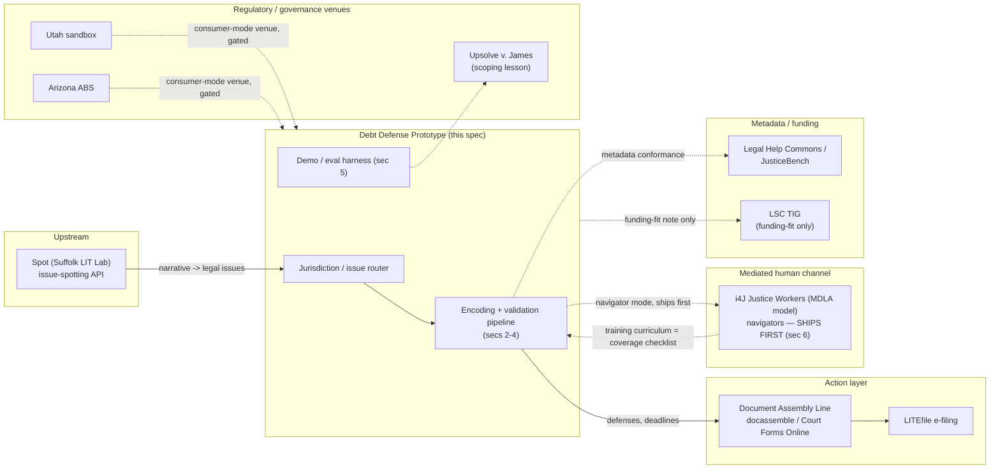

# Debt Defense Prototype — Architecture Spec

**Status:** RATIFIED FOR BUILD (v4). Phase A build started 2026-08-25. Task class: GREEN for infrastructure/schema/scaffold; content nodes ship at DRAFT/CORROBORATED tier per §3/§4's pipeline, never self-certified VALIDATED.
**Prepared:** 2026-08-24, revised 2026-08-25 (v2, decisions ratified), revised again 2026-08-25 (v3, AMPVR/Band-taxonomy gaps resolved, Direction E unblocked), revised again 2026-08-25 (v4, per Andy's build-authorization message): **v3 is ratified as-is** (Andy: "v3 spec is ratified"); the fifth anchor state is decided (**TX**, not a placeholder — see §10); ENG_HARDENING Tasks 2-4/7 hold with the rest of eviction *except* where applicable to debt as best practice, which Andy explicitly asked for — see the new decision record below and §3/§11; and **the validation cadence for Phase A is build-first**: AI does as much of the building and validating as possible, sampling-based (not granular per-rule) review, and **human review does not gate the build-out** — Andy's own words, 2026-08-25. This is not a new pipeline design; it's confirmation to proceed on the one already ratified in §3/§4/v2-decision-4, which was designed for exactly this.
**Scope of this document:** as of v4, a specification **and a live build log**. §10's thin slice is now under construction; the appendix below tracks what actually exists in the repo as of each revision, same discipline as the eviction-line state-of-record. Repository restructuring: Andy adopted the recommendation below (§12 revised) — new work (`rules/debt/`) scaffolds fresh rather than physically moving the live eviction line, which stays where it is.

> **v4 decision record, 2026-08-25 (Andy, in chat — not a separate directive doc; logged here as the record of record):**
> 1. **v3 ratified**, no further changes to the sections v3 finalized.
> 2. **ENG_HARDENING held with the eviction line**, *except*: any of Tasks 2 (CI pipeline), 3 (formal schema), 4 (scorer calibration suite), or 7 (independent-review packaging) that apply to debt as best practice should be applied there, as appropriate, rather than waiting for eviction's reopen. Task 6 (mutation testing) doesn't need separate carryover — it's already a day-one debt pipeline stage per §3(c). Task 5 (coverage matrix) stays naturally deferred, same gating logic as eviction (post-first-frozen-sample).
> 3. **Fifth anchor state: TX.** §10's "genuinely unresolved" flag on this is closed — decided, not data-driven, and logged as such.
> 4. **README placement:** `A2J_STACK_AND_CJAC_SCOPE.md` confirmed final by Andy; promoted to README's first doc link per the original checklist instruction.
> 5. **Repo restructuring:** Andy adopted Cowork's recommendation — scaffold `rules/debt/` fresh, fix the stale pre-relocation absolute path already sitting in `rules/validation/run_protocol.py` and 8 other files (unrelated latent bug, fixed regardless), remove duplicate/stray `validation/l2/`, leave the live `rules/eviction/` tree physically where it is. No big-bang move.
> 6. **Validation cadence for Phase A: build-first, AI-maximal, sampling-gated, not granular-gated.** Andy: "I want to build and validate with AI as much as possible and get something impressive... I don't want [human review] to gate the build-out." This is exactly what §3's RATIFIED sampling-audit model (v2 decision 4) was designed to do — the instruction here is to actually run it that way starting with Phase A, not to redesign it. The named-attorney certification step (§3g) stays human — that boundary doesn't move — but per-node review does not, and was never designed to.

> **v3 note (carried forward).** Both gaps v2 flagged are resolved: the ratified Band 1/2/3 taxonomy is defined in `docs/CJAC_ROADMAP.md` and `docs/OPEN_QUESTIONS_AND_LIMITATIONS.md` Q10; AMPVR and ratification-queue-health are defined in `docs/directives/COWORK_DIRECTION_DIRECTION_E_20260724.md` Task 3. See §1/§4 for the reconciliation detail.

---

## Why debt (the wedge)

Debt collection lawsuits are the highest-volume, least-defended civil case type in the state courts that track it, and the underlying law is federally centralized in a way eviction law is not — which is precisely the combination that makes a non-incremental, AI-industrialized validation approach worth testing here first.

The scale and asymmetry are documented by Pew's 2020 study of state civil dockets: debt claims went from roughly 1 in 9 civil cases in 1993 to roughly 1 in 4 by 2013, with the trend continuing in states reporting data since. In the cases Pew studied from 2010–2019, fewer than 10% of defendants had counsel, compared with nearly all plaintiffs. Over the preceding decade, more than 70% of debt collection lawsuits in the jurisdictions with available data ended in default judgment — a judgment entered because the defendant didn't show up or respond, not because a court found the debt valid. All 50 states and DC allow pre- and post-judgment interest on top of that default judgment (Pew, *How Debt Collectors Are Transforming the Business of State Courts*, 2020).

That volume-and-default pattern is exactly what CJaC's eviction-line discipline was built to catch — but debt has a structural advantage eviction doesn't: a strong federal spine. The Fair Debt Collection Practices Act (15 U.S.C. § 1692 *et seq.*) and its implementing Regulation F (12 C.F.R. Part 1006) govern collector conduct and required disclosures in every state; the Fair Credit Reporting Act (15 U.S.C. § 1681 *et seq.*) governs the credit-reporting side of the same disputes. One careful encoding of that spine, plus CFPB official interpretations and consumer guidance and FTC materials, amortizes across all 50 states and DC. What's left to vary by state is comparatively narrow and structured: statutes of limitations by claim type, answer deadlines, garnishment and post-judgment exemption amounts, and service/default-judgment procedure — closer to a lookup table than to the open-textured, jurisdiction-by-jurisdiction drafting the eviction line required.

**Scope, ratified (v2, decision 1): BROADER than v1's working assumption.** Collection-suit defense, pre-suit collector interactions (validation rights, disputes, cease-communication), garnishment and post-judgment exemptions, a medical-debt specialization lane leveraging the i4J Medical Debt Policy Scorecard corpus, and a bankruptcy-referral boundary encoded as a Band 3 marker — the system identifies when bankruptcy is the live question; it never advises whether to file. That last piece keeps the broader scope from sliding into advice-giving on the single highest-stakes adjacent decision a debtor faces.

---

## 1. Corpus assembly

### Federal spine (one encoding, all jurisdictions)

| Source | What it governs | Citation anchor |
|---|---|---|
| Fair Debt Collection Practices Act | Collector conduct: harassment, false/misleading representations, unfair practices; validation-notice content and timing | 15 U.S.C. § 1692 *et seq.* |
| Regulation F | Implements FDCPA; initial-disclosure content (debt amount, creditor name, dispute rights, original-creditor info), delivery timing (validation notice as first communication, or within 5 days after), communication frequency/channel limits, record-retention (3 years past last collection activity) | 12 C.F.R. Part 1006 |
| Fair Credit Reporting Act | Credit-report dispute process, furnisher obligations, the credit-reporting side of a collection dispute | 15 U.S.C. § 1681 *et seq.* |
| CFPB official interpretations & consumer guides | Regulation F commentary; plain-language guidance on debt validation, disputing a debt, responding to a lawsuit | consumerfinance.gov |
| FTC materials | Consumer-facing debt-collection guidance; enforcement precedent (see §9 on the DoNotPay action as an anti-pattern, not a source of law) | ftc.gov |
| Federal bankruptcy triggers (boundary-marker sourcing only) | Not full bankruptcy-code encoding — just the fact patterns that should trip the Band 3 referral marker (e.g., debt load relative to income at a rough screening level, multiple simultaneous judgments, wage garnishment already in effect) | 11 U.S.C., used only to identify the marker, never to advise chapter selection or filing |

### State layer (structured lookup-table variation)

Per state: statute of limitations by claim type (credit card, medical, other consumer debt — SOLs vary meaningfully by claim type within a state, not just by state), answer/response deadline after service, wage-garnishment and other post-judgment exemption amounts (homestead, bank-account, vehicle, tools-of-trade where relevant to a debt-defense context), service-of-process rules, and default-judgment entry procedure. Same schema pattern as §2 below, extended directly from the eviction line's per-state notice/service table pattern.

### Medical-debt specialization lane

Broader scope (v2 decision 1) adds this as a first-class lane, not just a reuse source. i4J's Medical Debt Policy Scorecard (Innovation for Justice, University of Arizona James E. Rogers College of Law + University of Utah David Eccles School of Business) already scores all 50 states across four policy goals: reducing debt incurrence, out-of-court resolution ability, court-navigation openness/efficiency/equity for self-represented debtors, and reducing post-judgment consequences. This is a directly reusable, open-source, state-scored dataset — check the license and cite i4J as the source of record, but treat it as a genuine corpus input for this lane, not background reading.

### Reuse inventory (harvest with license checks, primary law always controls)

- **CFPB/FTC public consumer materials** — plain-language explanations already vetted by the regulator; useful for the elicitation/explanation layer, not a substitute for citing the underlying rule.
- **State AG consumer-protection pages** — per-state color on collection practices and how to complain; secondary, needs a license check per page.
- **Statewide legal-help content (Michigan Legal Help, Illinois Legal Aid Online)** — established, actively maintained self-help platforms with existing debt-collection-response content. **Secondary corroboration only** — cross-checking our encoding against what an established legal-help org tells the same user, never a primary-law source.

Every fact in the corpus carries: **source, pin cite, retrieval date, license.** No exceptions — extends `VALIDATED_RESOURCES_REGISTRY.md`'s existing discipline rather than inventing a new one.

---

## 2. Encoding architecture

Extends the existing rules-JSON format (`SCHEMA_V2_DESIGN_SPEC.md` in the eviction line) rather than replacing it.

- **Band tags (1/2/3) — reconciled against the ratified taxonomy (v3).** The v1/v2 working examples hold up against `CJAC_ROADMAP.md`'s ratified definitions with no changes needed: Band 1 — SOL determination (past the deadline, yes/no, given claim type and last-payment date; outcome is freezable ground truth, same as eviction notice periods). Band 2 — chain-of-title adequacy (does the assignment chain actually establish the current plaintiff owns the debt): the *structure* is lookup-able (what documents/elements a valid assignment chain requires under the relevant state's law) even though the *application* to a specific exhibit set is judgment — the same shape as the ratified habitability/retaliation Band 2 examples. Band 3 — two boundary markers in this corpus: settle-vs-fight (a decision the system surfaces options for, never makes) and the bankruptcy-referral marker described in §1 (the system flags that bankruptcy may be the live question and refers out, full stop) — both permanent boundaries, never targets to cross, consistent with Band 3's definition.
- **Confidence tiers per node.** `VALIDATED` / `CORROBORATED` / `DRAFT`, traveling with each node, visible at runtime. A single release will plausibly ship with federal-spine nodes at VALIDATED and a newly-added state's garnishment table at CORROBORATED simultaneously — tier is a node property, not a file property.
- **Completeness checklists per node (the elicitation engine).** Drives the guided-interview / voice-demo layer in §5.
- **Consequences-and-next-steps fields.** Never a bare classification — "and here is what to file, by when," structurally required, not prose.
- **Jurisdiction resolution as a first-class input.** Resolved once, early, gating everything downstream — a national product can't resolve jurisdiction per-file the way the eviction line does.

---

## 3. Validation pipeline (the industrialized model) — RATIFIED (v2, decision 4)

**The statistical sampling audit + disagreement adjudication + attorney release certification model is the named-attorney standard for this track.** Item-by-item ratification, the eviction line's model, is retired for debt — this is Andy's explicit ruling, not a proposal awaiting sign-off. The pipeline below is what that standard consists of.

**(a) Grounded corroboration.** Three independent frontier models each derive the node's answer from cited authoritative source text — not from priors. A model that answers correctly but can't point to the specific statutory or regulatory text it derived the answer from does not count. Citations are mechanically verified against live source text. Consensus counts only across grounded derivations.

**(b) Adversarial generation.** Models attack each node with edge cases designed to break it — Direction D-4's method (`DIRECTION_D_ROADMAP.md`), applied as a first-class pipeline stage here rather than a periodic pass.

**(c) Mutation testing.** Deliberately corrupted copies of a rule must be caught by the eval suite, run against dev sets only — never a burned held-out set. The same method proposed as Eng-Hardening Task 6 for the eviction line's scorer; a pipeline stage from day one here.

**(d) Disagreement queue.** Every model-vs-model or model-vs-source conflict auto-files with evidence attached. Direction D-2, generalized — build once, both lines use it.

**(e) Statistical sampling audit.** Per release, a stratified random sample audited *blind* by the attorney, results published regardless of outcome. **Stratification variables:** band, tier, jurisdiction, traffic-weight. **Sample size:** target ±5% margin of error at 95% confidence per stratum, which needs roughly n≈385 at the conservative 50/50 assumption, less as the true error rate moves away from 50%. Strata too small to hit that report the achieved confidence interval honestly rather than claim precision not actually reached. See §8 for how this interacts with the ratified 99% target specifically.

**(f) Adjudication lane.** Human judgment reserved for what (d) and (e) surface, not routine review of clean nodes.

**(g) Attorney release certification.** A named attorney certifies the release based on (a)–(f)'s aggregate evidence, not a node-by-node signoff.

**Carried over as law, unconditionally, same as the eviction line:** dual-reporting of any score with a post-correction version, SHA-frozen artifacts, held-out sets burned after one use, published errata.

**ENG_HARDENING infrastructure, folded in as Phase A best practice (v4, 2026-08-25).** ENG_HARDENING itself stays on hold with the rest of the eviction line — Andy's instruction was explicit that its literal tasks aren't reactivated. But Andy also asked that anything in it applicable to debt as best practice be applied here rather than waiting. Assessed against the actual task list (`docs/directives/COWORK_DIRECTION_ENG_HARDENING_20260724.md`):
- **Task 2 (CI pipeline) — applies, build into Phase A.** Schema validation, scorer unit tests, frozen-artifact integrity checks, lint — natural to wire in now while the debt CI surface is still small, cheaper than retrofitting later.
- **Task 3 (formal rules schema) — applies, and already done.** `rules/schema/debt_schema_v1.0.json`, authored 2026-08-25 alongside this revision, extending the eviction line's schema pattern per §2. See `rules/debt/README.md`.
- **Task 4 (scorer calibration suite) — applies, arguably more urgent here than it was for eviction.** The sampling-audit scorer (§3e) is a new instrument, not a proven one; known-answer testing that the instrument reports what actually happened matters before it's trusted at volume.
- **Task 6 (mutation testing) — no separate carryover needed.** Already §3(c), a day-one debt pipeline stage.
- **Task 5 (coverage matrix) — naturally deferred**, same logic as eviction: needs a first frozen sample to map against.
- **Task 7 (independent-review packaging) — applies, and worth prioritizing** given Andy's stated interest in eventual third-party validation (v4 decision 6): a `REVIEW_README.md` for the debt scorer/pipeline, written early, makes that ask cheap whenever it comes.

**AMPVR metric — defined (v3).** Attorney-minutes per validated rule: attorney time spent per rule reaching VALIDATED status. Success is a *falling* AMPVR at constant-or-better validation quality — not falling AMPVR alone, which would reward speed over accuracy. Defined in `docs/directives/COWORK_DIRECTION_DIRECTION_E_20260724.md` Task 3; restated in `docs/DIRECTION_D_ROADMAP.md` and `docs/GLOSSARY.md`. For the debt track, this is the metric to track once Phase A ratification volume is high enough to be meaningful (not from day one, when n is too small to be signal) — paired with ratification-queue-health (open-proposal count, age distribution, inflow/outflow) so a falling AMPVR from rubber-stamping doesn't read as progress.

---

## 4. Continuous improvement

- **Statute/case watch, auto-generated from the corpus's own pins.** Same design as Direction D-3 — build once, both lines use it where jurisdiction-agnostic.
- **Usage telemetry → improvement queue.** Collect only what analysis requires — node IDs and coarse outcome categories, never free-text user answers or PII. Hard architectural constraint, not a policy layered on top of a system that could retain more.
- **Tier-promotion rules.** DRAFT → CORROBORATED: passes (a)–(d) with no unresolved disagreement. CORROBORATED → VALIDATED: survives the sampling audit (e) at attorney certification. Demotion triggers: a statute/case-watch hit, an audit failure, or a mutation-testing miss revealing the eval suite wasn't sensitive enough — demotion is the system re-earning its own confidence, not a punishment.
- **Freshness SLAs per module and a decommissioning rule.** Stated maximum staleness before automatic pull from VALIDATED; a rule for retiring an unmaintained module rather than letting it rot at a stale label.

---

## 5. Demo and evaluation harness

Two layers, one machinery — built in parallel with the thin slice, not after it (see §10).

**(a) Frozen randomized question sets.** SHA-anchored, one-shot scored, held out, burned after one use, dual-reported if corrected.

**(b) The scenario voice demo.** A non-attorney verbally describes a debt situation; the system elicits facts per the completeness checklists (§2) and answers with tier-labeled, cited output. **The demo shows the whole tree honestly, tier labels on** — including CORROBORATED/DRAFT nodes outside the VALIDATED thin slice (v2 §2 requirement).

**Both layers are Direction E's Tier 1 and Tier 2 methods, pointed at debt (unblocked, v3).** Direction E is now in hand (`docs/directives/COWORK_DIRECTION_DIRECTION_E_20260724.md`); its eviction-specific v0.4 gate is superseded by the eviction hold, and per Andy's 2026-08-25 instruction both tiers now apply to the debt track:

- **Tier 1 — narrative-perturbation testing.** The same underlying debt fact pattern (a given SOL posture, claim type, service history) is restated in varied narrative forms — register, order of facts, omitted-vs-implied details, the way a real person under stress would actually describe a collection lawsuit rather than a clean litigator's fact pattern — to test whether the system's answer is stable under surface rewording. This is layer (a) above: frozen randomized question sets, but built from perturbed narratives, not just clean facts.
- **Tier 2 — interactive elicitation harness.** A multi-turn simulated-user harness that elicits facts from the debtor conversationally rather than being handed a complete fact pattern up front — scoring both *elicitation* (did the system ask the right questions, cover the completeness checklist in §2) and *outcome accuracy* given what it elicited. This is layer (b) above: the scenario voice demo, formalized into a scored harness with hidden fact sheets and persona tiers.

**For debt specifically:** narrative rewrites and personas are built on debt fact patterns — a person served with a collection summons, a person getting pre-suit collector calls, a person facing wage garnishment — not reused or adapted from the eviction line's fact patterns. This is new corpus work, not a port. Building it is a Phase A/C workstream (§10), no longer blocked on the harness design itself; the debt-specific personas and perturbations still need to be authored, which is real work, just no longer *undefined* work.

Voice interaction via the skill, in the standard interface.

**All demo correctness claims pre-registered and SHA-anchored before any external showing.**

---

## 6. Runtime and distribution

- **Anthropic skill/plugin environment first.**
- **Model-agnostic core.** No runtime lock-in to a single model provider — required for the multi-model verification pipeline (§3, §11) to actually corroborate itself.
- **Zero-IT deployment as a stated design requirement.**
- **Two presentation modes over one decision-logic core (v2 decision 2, staged).** Navigator mode (agency/worker in the loop) ships first. Consumer mode (direct) ships only behind the elicitation-testing and ethics gates already defined in §5/§9 — this is a deployment gate, not a build-order preference; both modes can be *specified* and even *demoed* together (a demo is not a deployment), but only navigator mode is cleared to actually go live first.
- **App vs. plugin analysis.** Default: plugin/skill, not a standalone app — lower deployment friction, faster iteration, keeps the core model-agnostic. Flips only if evidence emerges that navigator or consumer users can't reach the tool through a plugin/skill surface.

---

## 7. Integration map

| System | We consume | We provide | Interface format | Dependency status |
|---|---|---|---|---|
| **Spot** (Suffolk LIT Lab) | Plain-narrative → legal-issue classification, upstream of our jurisdiction/issue router | Nothing upstream | Spot's issue-spotter API (Spot Click-Trust-governed; our use — issue routing into a legal-help tool — is the intended use) | **Contacted-none.** Publicly documented, technically compatible; no outreach has happened. |
| **Document Assembly Line** (docassemble / Court Forms Online) + **LITEfile** | Nothing — we are upstream | Decision output (defenses, deadlines, next steps) to answer-generation interviews and e-filing | Handoff schema **not yet specified**; propose JSON matching §2's consequences-and-next-steps fields as the starting point. docassemble should be evaluated as a compile target. | **Aspirational.** LITEfile is still in development at the LIT Lab (targeted toward a Dec. 1 launch per their public updates) — not live yet. Court Forms Online / Assembly Line software are live; a handoff into an existing interview is feasible now. |
| **i4J Justice Workers** (MDLA model) / navigators | Public MDLA training curriculum as a requirements checklist for completeness-checklist coverage (§2) | Encoded determinations for the navigator-mode deployment (§6, ships first) | Not yet specified — likely the docassemble-handoff format, consumed by a human | **Aspirational-to-contacted.** Live, public, well-documented; no contact made. Curriculum review as a requirements source can start immediately, independent of outreach. Highest-relevance partner given navigator mode ships first. |
| **Utah sandbox / Arizona ABS** | Nothing directly — regulatory venues | N/A | N/A | **None (governance venue).** Relevant if/when consumer mode clears its gate (§6). Utah's sandbox (extended through 2027) and Arizona's ABS program (100th entity approved Sept. 2024) are the two live U.S. venues permitting this kind of non-lawyer-delivered help directly. **Governance note:** *Upsolve, Inc. v. James* — Upsolve's non-lawyer "Justice Advocates" helped pro se debt defendants complete a check-the-box answer form and won a 2022 SDNY injunction against NY's UPL enforcement, but the **Second Circuit reversed on September 9, 2025**, holding the program violated NY's UPL statutes and rejecting the First Amendment challenge. A narrow, well-funded, professionally represented program lost at the appellate level — read as evidence that UPL scoping needs to survive a hostile posture, not a sympathetic one. See §9. |
| **Legal Help Commons / JusticeBench** | Commons Knowledge Standards (jurisdiction, issue, language, provenance, license, citation) as the metadata schema our corpus should conform to; JusticeBench's LIST taxonomy (1,100+ codes) as a candidate issue-classification vocabulary | A JusticeBench listing once something is listable | Commons Knowledge Standards field set; LIST issue codes | **Contacted-none, low-friction.** Both explicitly open and soliciting contributions. Runs through Andy's channel. Metadata-schema conformance can start immediately as an internal design choice. |
| **LSC TIG** | Nothing technical | N/A | N/A | **Funding-fit note only.** Funds *existing LSC grantees'* tech projects; CJaC/debt isn't itself a grantee, so eligibility needs a grantee partner. |

---

## 8. Reliability targets and measurement — RATIFIED target, with the measurement-honesty section v2 requires

**Ratified target (v2, decision 3): 99% on VALIDATED nodes**, measured per-tier and per-band on adequately-powered samples, dual-reported per house law. **Long-term aspiration: five-nines-class reliability, framed as an engineering-process standard** — achieved and described the way enterprise infrastructure achieves it (defect prevention, redundancy, monitoring, regression discipline), not as a statistically-certified per-node accuracy figure. Those are two different kinds of claim, and this section exists to keep them from being conflated with each other in any published material.

### What sample sizes can and cannot certify

Two different statistical situations apply here, and the spec needs to be precise about which one is in play for any given published number:

**Estimating an error rate (the normal case).** For a stratum where some errors are expected and the audit is measuring the rate, the standard margin-of-error formula applies: n≈385 gets a ±5% margin at 95% confidence on a 50/50 prior, tightening as the observed rate moves toward 0 or 100%. To tighten the margin to ±2% needs roughly n≈2,400 at the same confidence level. This is expensive at debt-corpus scale (many strata × many jurisdictions) and is the reason §3(e) proposes traffic-weighting the sample rather than sampling uniformly.

**Certifying a zero-defect claim (the relevant case for "99%" and beyond).** If an audit sample of size *n* finds **zero** errors, the standard "rule of three" approximation gives a 95%-confidence upper bound on the true error rate of roughly 3/*n*. Concretely:

| Zero-defect sample size | 95%-confidence upper bound on true error rate | What that supports claiming |
|---|---|---|
| n = 100 | ≈ 3% | Cannot support a 99% (1% error) claim |
| n = 300 | ≈ 1% | Just supports "consistent with ≤1% error, 95% confidence" — the ratified 99% target, at the edge |
| n = 385 (the §3(e) baseline) | ≈ 0.78% | Comfortably supports the 99% target |
| n = 3,000 | ≈ 0.1% | Supports a "99.9%"-class claim |
| n ≈ 300,000 | ≈ 0.001% | The scale a genuine five-nines (99.999%) statistical certification would need — not achievable at this project's sampling-audit scale |

**This is the honest basis for treating "five-nines" as a process aspiration rather than a statistical claim.** No realistic per-release sampling audit reaches n in the hundreds of thousands per stratum; five-nines-class reliability, if claimed, has to be claimed the way an enterprise SLA is claimed — as a description of the engineering discipline producing the system (the pipeline in §3, the CI/regression discipline extended from Eng-Hardening, sustained defect-free operation over time and volume) — never as "our sampling audit found this." **Exact claim language permitted at each evidence level:**

- **n < 300, zero defects, or any nonzero defect count at any n:** report the point estimate and confidence interval; no "near-perfect" or percentage-based marketing language. State the interval, state the n, state the stratum.
- **n ≥ 300–385, zero defects:** "consistent with ≤1% error rate at 95% confidence, n = [n]" — the 99% target, stated with its actual basis, not asserted as a fact about the population.
- **n ≥ 2,400+, zero defects, sustained across multiple releases:** "consistent with ≤0.1%+ error rate at 95% confidence" language becomes available, still always with n and confidence level stated.
- **Five-nines-class language:** permitted only as a description of engineering *process* (with the specific practices named — defect prevention, redundancy, monitoring, regression gating), explicitly never presented as a sampling-audit-certified accuracy figure. Any published material using "five-nines" language without this distinction is a compliance error under this spec's own discipline.

**Demo claims held to the same standard** — no lower bar for what's shown in a demo than what's published for the system generally, per §5's pre-registration requirement.

---

## 9. Governance and ethics

- **Information-vs-advice line under interactive use.** The eviction line's DISCLAIMER.md discipline (legal information, not legal advice; VALIDATED-only for real-person deployment) extends here, but interactivity raises the stakes — a voice demo that elicits facts and returns a tailored, cited answer sits closer to the advice line than a static rules file. The staged rollout in §6 (navigator mode first) is this project's primary practical mitigation while that line gets drawn precisely: a human intermediary in the loop for the first deployment stage, direct-consumer exposure deferred until the ethics and elicitation-testing gates clear.
- **UPL scoping — tight, Upsolve-style boundaries on any output that approaches advice.** *Upsolve, Inc. v. James* is the load-bearing precedent (§7): a narrow, well-resourced, non-lawyer-assistance program lost at the Second Circuit in September 2025. "Narrow and well-intentioned" is not sufficient insulation — scoping needs to survive a hostile UPL enforcement posture.
- **The DoNotPay enforcement action as the anti-pattern the claims discipline exists to avoid.** FTC settlement, finalized January 2025: $193,000 payment, mandatory notice to 2021–2023 subscribers, forward-looking bar on claiming to substitute for a professional service without evidence. Federal-level warning about *overclaiming AI legal capability*, distinct from and additional to the state-level UPL risk. This project's tier-labeling (§2), pre-registration (§5), and the §8 claim-language table exist specifically so no claim outruns what the pipeline has actually demonstrated.
- **Named-attorney accountability at the release level**, per §3(g).
- **Open-source licensing** — Apache 2.0, consistent with the eviction line, under the CJaC umbrella naming resolved below.

---

## 10. Sequencing: demo-first thin slice (supersedes v1's corpus-complete-first phasing)

**Do not sequence corpus-complete → then demo.** A thin vertical slice at full depth, then breadth behind it.

### The slice

Highest-traffic path: person served with (or fearing) a collection lawsuit → jurisdiction + claim-type resolution → SOL/time-bar determination → answer deadline + filing mechanics → affirmative defenses screen (limitations, standing/chain-of-title flag as a Band 2 structure, identity) → FDCPA validation/dispute rights where pre-suit → consequences-and-next-steps output.

**The slice ships at VALIDATED tier** (full pipeline §3(a)–(g)); everything else in the tree may exist at CORROBORATED/DRAFT with tiers visible — the demo shows the whole tree honestly (§5).

### Coverage: federal spine + 5 anchor states — proposed, with an honest data gap flagged

**Locked (v4, 2026-08-25, Andy's decision — not data-driven, and logged as such): TX, CA, UT, AZ, NY.** This spec's per-state assessment below stands as the reasoning on file; TX's inclusion is a decision, not a claim that per-state volume data was ultimately pulled.

- **UT and AZ — solid, non-volume rationale.** Both host live regulatory venues (Utah's sandbox, extended through 2027; Arizona's ABS program, 100th entity approved September 2024) that are directly relevant if/when consumer mode clears its gate, and both host i4J (University of Arizona + University of Utah), the source of the medical-debt specialization corpus (§1) and the MDLA navigator-mode precedent (§7). Including these two is justified independent of raw lawsuit volume.
- **CA — solid, infrastructure rationale.** The eviction line's existing methodology, tooling, and institutional experience are CA-first; reusing that muscle memory for the debt line's first non-federal state lowers execution risk regardless of CA's exact debt-suit volume ranking.
- **TX and NY — volume rationale, decided without hard data (v4).** Both are commonly cited in consumer-law literature as high-volume debt-litigation states, and NY carries specific regulatory-venue relevance as the *Upsolve v. James* jurisdiction (cuts two ways — familiar terrain, but also the state that produced the sharpest UPL loss on record). This spec never obtained hard per-state debt-lawsuit volume data (e.g., NCSC Court Statistics Project) to rank TX against NY or other alternatives — that research task was recommended but not required, and Andy decided TX directly rather than waiting on it. Logged honestly: TX is in because Andy chose it, not because this spec proved it's the highest-volume choice.

### Harness built in parallel, not after

The demo harness (§5) is a Phase A workstream, concurrent with the slice's encoding — not a Phase B addition. **Unblocked as of v3:** the Direction E Tier 1/Tier 2 harness design now exists (§5), so this workstream's remaining dependency is debt-specific corpus work — authoring perturbed narratives and personas grounded in real debt fact patterns — not a missing methodology. That authoring work is real and not yet started; it belongs in Phase A's queue alongside the corpus/encoding lanes, and its progress (or lack of it) should stay visible in queue health (§11) the same way the old blockage was, so slow authoring doesn't quietly read as "harness done."

### Dated critical path — an honest planning estimate, not a promise

This spec produces a range, explicitly distinguishing **active-work time** (assuming the multi-agent lanes in §11 run close to continuously) from **calendar time** (which the eviction line's own history shows can run much longer — real gaps of weeks between active sessions have already occurred on that line). The estimate below is calibrated loosely against that same eviction-line history as the only real velocity data this project has:

| Phase | What | Active-work estimate | Real bottleneck |
|---|---|---|---|
| A | Corpus scaffold + federal-spine encoding (parallel lanes b, c per §11) | 2–4 weeks | Verification throughput (§3a–d), not generation speed |
| B | 5-state layer tables, run in parallel not sequentially | 2–4 weeks (overlapping with A once the pipeline exists) | Same — grounded corroboration + citation-check capacity |
| C | Demo/eval harness build | 2–3 weeks, parallel with A/B | **Unblocked (v3)** — Direction E's Tier 1/Tier 2 methodology now exists; the remaining bottleneck is authoring debt-specific perturbed narratives and personas, a normal corpus-work estimate rather than an open-ended external dependency |
| D | Statistical sampling audit + blind attorney review + certification | Not AI-cycle-bound — gated on Andy's/the certifying attorney's available review hours | **The single biggest true unknown** — this spec cannot estimate Andy's calendar on his behalf |
| E | Demo hardening, claims pre-registration | 3–5 days once A–D clear | — |

**Rough total, active-work time, phases A–C+E only: 6–10 weeks**, assuming continuous multi-lane operation. (v3 update: the Direction E arrival condition in the prior version of this sentence is now moot — the document is in hand.) **Phase D (attorney review) sits outside that estimate entirely** and is realistically the phase most likely to stretch calendar time well beyond the active-work figure — the eviction line's own blind-review and ratification cycles have taken anywhere from same-day to multi-week in practice. **Earliest credible demo date: this spec will not print a calendar date**, because doing so would bake in an assumption about Andy's own review bandwidth and about when Phase A actually starts — both outside this spec's authority to assume. Once those two variables are known, the active-work estimate above converts to a real date in a single conversation.

### Staged demo plan: Stage 1 (machinery) / Stage 2 (outreach-grade) — v3, per Andy's request

**Flagged, not silently guessed:** Andy's files.zip cover instruction (item 5) asked for this staged plan "per my prior message" — a message this session has no record of. What follows is a best-effort construction from this spec's own existing sequencing (§10 phases, §5 harness layers), not a reproduction of whatever format or content Andy originally specified elsewhere. If Andy's prior message specified different stage boundaries, dates, or audiences, this section should be treated as a draft to correct against it, not as confirmed.

**Stage 1 — machinery demo.** The thin slice (above) running end-to-end through the scenario voice demo (§5b), tiers visible and honest (VALIDATED where the slice reaches it, CORROBORATED/DRAFT elsewhere), with both Tier 1 and Tier 2 lower-bound tests (§5) run at least once against the debt-specific corpus. Proves the pipeline works and the tiering is truthful. **Audience: Andy and counsel only — not client-facing, not outreach-ready.** No claims pre-registered yet; this stage exists to validate the machinery, not to be shown externally. **Date:** corresponds to the end of Phases A–C in the table above — roughly 6–10 weeks of active work from whenever Phase A actually starts, with the same caveat the table already states (calendar time can run longer; this spec will not convert that to a fixed date without knowing the start date).

**Stage 2 — outreach-grade.** Adds Phase D (statistical sampling audit + blind attorney review + certification) and Phase E (hardening, claims pre-registration) on top of Stage 1. This is the version safe to show external audiences (BayLegal, funders, i4J, prospective pilot partners) — validated-tier claims defensible under scrutiny, pre-registered before any external showing (§5). **Date: honestly, not printable here** — Phase D is explicitly outside the active-work estimate and gated on Andy's/the certifying attorney's available review hours (table above), which is the single biggest true unknown in this whole schedule. Stage 2's date is Stage 1's date plus however long Phase D actually takes once it starts — this spec will convert that to a real date the moment Andy's review bandwidth for Phase D is known, same discipline as the rest of §10.

---

## 11. Execution model — multi-agent, single-orchestrator

One orchestrator, parallel worker lanes, a multi-model verification pipeline. Not a swarm — every lane's output passes through one integration point before it's real.

### One writer

**Cowork is the single orchestrator and the only repo writer.** All agent outputs land as artifacts with provenance metadata; Cowork integrates them. This is what keeps the provenance/hash system intact — the same discipline that made every patch in this project's history verifiable against a fresh clone before Andy applied it. No exceptions, including under time pressure.

### Parallel worker lanes

Separable work, run concurrently, each producing artifacts to a task queue rather than writing directly:

- **(a) Corpus harvest.** State-layer lanes are embarrassingly parallel — each state's SOL/deadline/exemption table (with per-fact source pins) is independent of every other state's, so this lane scales with however many can be usefully run without outrunning verification capacity (see queue-health note below).
- **(b) Federal-spine encoding.** One jurisdiction-agnostic lane — FDCPA/Reg F/FCRA nodes, Band-tagged.
- **(c) Demo/eval harness build.** Unblocked (v3) — Direction E's Tier 1/Tier 2 methodology exists (§5); this lane now runs on authoring debt-specific perturbed narratives and personas, concurrent with (a)/(b), not gated on an external document.
- **(d) Adversarial red-team lane.** Attacks encoded nodes as they land from (a)/(b), files findings into the disagreement queue (§3d) — this is §3(b)'s adversarial-generation stage running as a standing lane rather than a discrete pipeline step.

**Sizing rule: size parallelism to what can be integrated and verified, not what can be generated.** This is the project's own standing queue-health discipline (`COWORK_DIRECTION_A_CADENCE_AUTONOMY.md`: NOW / depth of NEXT / what's BLOCKED and on what; if NEXT is shallow, say so and propose refill) applied to lane throughput specifically — generation racing ahead of verification just grows an unverified backlog, which is worse than not generating, because it creates the appearance of progress without the substance.

### Verification pipeline (multi-model by design)

- Drafting by one model family.
- Grounded derivation by three independent frontier models (§3a) — each must derive from cited source text, mechanical citation checks against live sources, consensus counts only on grounded derivations.
- **Model-family separation** — confirmed against the actual Direction E text (v3): between generators and verifiers (§3), per this spec's existing verification-pipeline design; and, per Direction E's Tier 2 harness spec itself, **"actor and subject from different model families; actor prompts and fact sheets never exposed to the subject"** — the persona playing the debtor in the elicitation harness must be a different model family from the system being tested, and the system never sees the actor's hidden fact sheet or prompt. The v1/v2 working guess at this rule (don't let the same model family both generate/verify or both play persona/system) turns out to match; stated here as confirmed, not guessed.

### No agent ratifies anything

Tier promotion to VALIDATED happens only through the sampling-audit + certification lane (§3e, §3g). Agents propose; the pipeline corroborates; the attorney certifies releases. This is the same principle as the eviction line's "no rule edits without ratification," restated for a multi-agent context where the temptation to let a high-confidence agent output self-promote is structurally higher.

### Task-queue design, budgets, provenance, integration

- **Task queue.** Each lane pulls from and writes to a queue analogous to the eviction line's existing `rules/validation/queue/` job-file pattern — extend that mechanism rather than building a new one, since it already has the dispatcher/heartbeat/logging discipline this project needs.
- **Per-lane budget/quota controls.** Each lane needs a stated cap (API calls, model-cycles, or wall-clock budget per run) so that a runaway or misconfigured lane can't silently consume disproportionate resources or flood the verification bottleneck. Specific numbers are a Phase A implementation detail, not fixed here.
- **Artifact provenance schema.** Every lane output carries: lane ID, source model(s), timestamp, input corpus version/SHA, and a status flag (proposed / verified / rejected) — extending `VALIDATED_RESOURCES_REGISTRY.md`'s per-fact provenance fields (§1) to per-artifact provenance at the pipeline-output level.
- **Integration/reconciliation step.** Before any lane's output is merged, Cowork runs: (1) schema validation against §2's node format, (2) a check that claimed provenance actually resolves (the cited source text exists and says what's claimed), and (3) a merge-conflict check against any other lane's concurrent output touching the same node. Only after all three does an artifact enter the pipeline stages proper (§3).

---

## 12. Naming and repository structure — DECIDED (v4, 2026-08-25)

**Ratified (v2, decision 6, resolved v4): CJaC umbrella with subprojects — scaffold new work, don't move the live line.** Andy adopted Cowork's recommendation on 2026-08-25 rather than the big-bang physical move originally sketched in v2/v3. What actually happened:

- **`rules/debt/` created fresh** (`federal/`, `state/`), scaffolding the domain-subproject pattern for new work from day one — zero migration risk, since nothing existing had to move.
- **`plugins/eviction-defense/` and `plugins/consumer-debt/` already existed** at the skill-packaging layer before this decision was made — the domain-separated-subproject pattern Andy wants is already true there. Future domains (e.g. domestic violence) extend the same way: `plugins/<domain>/`, `rules/<domain>/`.
- **`rules/eviction/` stays physically where it is.** Live, working, and every script/plist that touches it already points at the current location — moving it is deferred to its own dedicated, tested migration (dispatcher paused first), not bundled into Phase A.
- **Latent bug fixed as a byproduct of this review, unrelated to any move:** `rules/validation/run_protocol.py` and 8 other operational scripts/docs still contained the *pre-relocation* absolute path (`~/Documents/GitHub/a2j-ai`, dead since the July outage) in usage comments/docstrings — fixed to the current path. Historical dated records (`docs/DAILY_CHANGELOG.md`, `results/*.md`, etc.) correctly left untouched — those are accurate as of the date they describe.
- **Cleanup, same pass:** stray duplicate `validation/l2/output/` directory (drift from an old run, distinct from the real `rules/validation/l2/`) removed. Two placeholder-only `.env`-pattern files at repo root removed (contained `PASTE_TOKEN_HERE`, not a real credential — no exposure — but shouldn't have been committed); `.gitignore` hardened (`.env.*`, `.e`) to catch the pattern going forward.

**The risk this avoids, stated plainly:** the July dispatcher outage was caused by a folder relocation interacting badly with macOS's background-process permissions, and took a multi-day diagnostic effort to root-cause. The plist's absolute `WorkingDirectory` and the dispatcher's own path assumptions are still there, unchanged, working — this decision keeps them that way rather than risking a repeat for organizational tidiness alone.

---

## Decisions — ratified 2026-08-24/25 (v2), baked into the sections above

1. **Scope: BROADER** — see "Why debt," §1.
2. **Users: BOTH, staged** — navigator mode ships first, consumer mode gated — see §6, §9.
3. **Reliability target: 99% on VALIDATED nodes**, five-nines-class as process aspiration — see §8.
4. **Human model: RATIFIED** — sampling audit + adjudication + certification is the named-attorney standard — see §3.
5. **Priority: DEBT IS TOP PRIORITY. Eviction line: HOLD** — logged in the state-of-record with today's date; see the appendix below and the standalone `WORK_QUEUE.md`/`PROJECT_STATE_OF_RECORD.md` entries delivered alongside this spec.
6. **Naming: CJaC umbrella with subprojects** — RESOLVED (v4): scaffold new work fresh (`rules/debt/`), leave the live eviction line physically in place — see §12.
7. **Validation cadence (v4, new): build-first, AI-maximal, sampling-gated, not granular-gated.** Andy's explicit instruction, 2026-08-25 — see the v4 decision record at the top of this document and §3's ENG_HARDENING carryover. Phase A proceeds without waiting on per-node Andy review; the sampling-audit pipeline (§3) and named-attorney release certification (§3g) are the actual gate.

### Genuinely unresolved, flagged rather than guessed

- ~~**The fifth anchor state (TX vs. NY vs. an alternative)** lacks hard per-state volume data in this session — §10.~~ **RESOLVED (v4):** TX, decided by Andy, not data. See §10.
- ~~**Direction E Tier 2 harness dependency** blocks Phase C (demo harness) and this spec's own §5/§11 content until that document exists — §5, §10, §11.~~ **RESOLVED (v3):** Direction E is in hand; see §5, §10, §11. Remaining work is authoring debt-specific narratives/personas, not a missing design.
- **Physical repo restructuring** is proposed but flagged as its own migration risk, given this project's direct history with folder-relocation failures — §12.
- **"Keep-warm" assumption about the eviction line's monitoring** (v2 item 5 calls it "cheap, preserves freshness data," implying continuous operation) — see the appendix below for what the actual cadence has looked like; it has not been continuous, independent of today's hold.

---

## Appendix: Eviction-line state-of-record — ON HOLD as of 2026-08-25

*Prepared fresh from the live repository. This is the "same-day" hold logging the v2 directive requires; see also the standalone updates to `WORK_QUEUE.md` and `PROJECT_STATE_OF_RECORD.md`.*

**Status: HOLD, effective 2026-08-25, per Andy's priority directive (v2, decision 5).** No new eviction drafting, freezes, or v0.4 work until Andy re-opens it. Keep-warm (dispatcher + scheduled monitoring) continues.

**Active rules version:** `ca_eviction_v3.json` remains the sole active version, unchanged. No v4 exists. vProof1 (`ca_eviction_v2.json`, SHA `cc0cfab63ae1591e2b88…`) remains byte-frozen.

**Automated dev-set regression monitor — a correction to this spec's own prior appendix.** The 2026-08-24 draft of this spec reported the monitor as apparently dormant since 2026-07-27. That was accurate as of that clone, but is now superseded: two further runs (2026-08-15, 2026-08-19) landed in the repository as of today's clone, both 12/12 = 100%, `newly_failing: 0` — accuracy held. **Consensus quality did dip on both**: 08-15 ran PARTIAL-CONSENSUS (11/12 dual-model, α = 0.917), 08-19 ran PARTIAL-CONSENSUS (10/12 dual-model, α = 0.75) — one and two items respectively fell back to single-model corroboration, most plausibly a transient API issue on the affected items rather than a rules problem (no item newly failed). **The honest picture for the "keep-warm is cheap and continuous" assumption in the v2 directive: the monitor is running, but on a visibly sparse, not-daily cadence** (07-26 → 08-15 → 08-19, then nothing until today) — consistent with a noon-triggered local dispatcher that only fires when the machine happens to be on at that moment, not a guarantee of continuous freshness data. Worth knowing before assuming the keep-warm period will produce a complete monitoring record.

**Proposals 16/17/18 (ratified 2026-07-21 evening):** still not executed, and now formally on hold rather than merely delayed. Proposal 16's self-critique pass never ran; proposal 17 (sequenced after it) never started; proposal 18 remains correctly log-only by design. **These stay exactly where they are until Andy re-opens the eviction line** — this directive does not resume them.

**Direction D roadmap (D-2 through D-5):** remain ROADMAP-DEFINED, none building — also on hold. Note per §3/§4/§11 above: D-2 (disagreement queue) and D-3 (statute watch) are explicitly proposed for *shared* build across both lines in this spec — building them under the debt track's Phase A would, if Andy approves, be the mechanism that finally gets them built, just not under the eviction-specific trigger (proposal 17) that originally gated them. Flagging this as a real path to unblocking two eviction-line roadmap items as a side effect of debt work, not a reason to reopen eviction drafting itself.

**Engineering hardening:** Task 1 complete. Tasks 2–4/7 have no record of having started (scoped alongside proposal 16, which never ran) and now stay on hold with the rest of the eviction line.

**Collateral & publication checklist:** the broader "docs are final" checklist executed 2026-08-25 (same delivery as this v3 revision) — see `docs/DAILY_CHANGELOG.md`'s 2026-08-25 entry for the row-by-row record. `CJAC_ROADMAP.md` and the Direction E directive that this spec was blocked on in v2 are both now committed; this spec is no longer blocked on either.

**Net picture for Andy:** the eviction line is stable and nothing is broken; it is now formally paused rather than informally dormant, with keep-warm monitoring continuing on the sparse cadence described above. This directive did not touch any eviction rules file, golden set, or ratified proposal.

---

## Appendix 2: Debt-line build log — Phase A, started 2026-08-25 (v4)

*Live build log, same discipline as the eviction-line state-of-record above. Updated as work lands, not regenerated from scratch each time.*

**Infrastructure:**
- `rules/schema/debt_schema_v1.0.json` — formal schema (ENG_HARDENING Task 3, folded in per the v4 decision record). Extends the eviction schema pattern. Key departure: tier and band are node properties, not file properties (spec §2/§4) — validated in code (`jsonschema`), not just documented.
- `rules/debt/` scaffold — `federal/`, `state/`, each with a README explaining the pattern. TX locked as the fifth anchor state alongside CA/UT/AZ/NY.

**Content — one node, DRAFT tier:**
- `rules/debt/federal/fdcpa_validation_notice_v1.json` — **FDCPA-VALIDATION-NOTICE-1692g**, Band 1 (deterministic). Encodes 15 U.S.C. § 1692g and 12 C.F.R. § 1006.34 (Regulation F) together — Reg F elaborates and partially supersedes the statute's bare five-item list with the fuller Model Form B-1 content regime and clarifies timing/mailbox-rule computation; both are cited verbatim with live-fetched source text (Cornell LII, eCFR, retrieved 2026-08-25), consistent with §3(a)'s grounded-corroboration requirement that a derivation must point to specific source text.
- **Tier is honestly DRAFT, not CORROBORATED or VALIDATED.** This is a single-model derivation — it has not yet passed the three-independent-frontier-model grounded corroboration (§3a), adversarial generation (§3b), or disagreement queue (§3d) stages, let alone the sampling audit (§3e) and attorney certification (§3g) that VALIDATED requires. Tier-promotion is not automatic and is not claimed here.
- Completeness checklist and consequences-and-next-steps fields populated per §2's structural requirement (never a bare classification).

**What's not yet started:** the remaining federal-spine nodes (Reg F disclosure requirements beyond validation, FCRA basics), all five state layers (TX/CA/UT/AZ/NY — SOL, deadlines, exemptions, service/default-judgment procedure), the CI pipeline (ENG_HARDENING Task 2), the scorer calibration suite (Task 4), and the actual multi-model verification pipeline (§3a-g) running against this or any future node. One node proves the schema and grounding discipline work end-to-end; it is not Phase A complete. See `docs/WORK_QUEUE.md` for the queued next items.

---

*Copyright 2026 Andrew M Cohen. Apache 2.0.*
