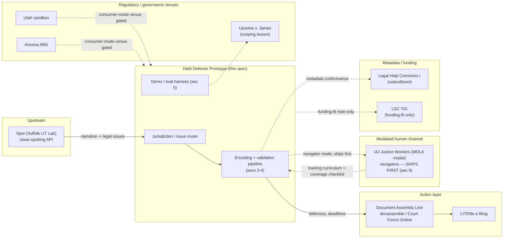

# Debt Defense Prototype — Architecture Spec

**Status:** RATIFIED FOR BUILD (v5). Phase A anchor-state build complete (2026-08-25/26); corroboration runner delivered and concept-demo re-scope ratified (2026-08-26, "Phase A Unblock" + "Concept Demo First" directives). Task class: GREEN for infrastructure/schema/scaffold/runner; content nodes ship at DRAFT/CORROBORATED tier per §3/§4's pipeline, never self-certified VALIDATED. **Near-term target: concept demo (§10), CORROBORATED tier, federal+TX+CA corpus, 2-3 weeks from 2026-08-26 — supersedes the Stage 1/1.5/2 ladder as the immediate goal without deleting it.**
**Prepared:** 2026-08-24, revised 2026-08-25 (v2, decisions ratified), revised again 2026-08-25 (v3, AMPVR/Band-taxonomy gaps resolved, Direction E unblocked), revised again 2026-08-25 (v4, per Andy's build-authorization message), revised again 2026-08-26 (v5, per Andy's "Phase A Unblock" and "Concept Demo First" directives: corroboration runner package delivered, §8 gains a census-audit subsection and a CONCEPT-DEMO claim-language row, §10 gains the concept-demo near-term target ahead of the Stage 1/1.5/2 ladder and the Stage 1.5 tier is added to that ladder, one new Band 3 node authored [`TX-DEFAULT-JUDGMENT-SET-ASIDE-DISCRETIONARY`]): **v3 is ratified as-is** (Andy: "v3 spec is ratified"); the fifth anchor state is decided (**TX**, not a placeholder — see §10); ENG_HARDENING Tasks 2-4/7 hold with the rest of eviction *except* where applicable to debt as best practice, which Andy explicitly asked for — see the new decision record below and §3/§11; and **the validation cadence for Phase A is build-first**: AI does as much of the building and validating as possible, sampling-based (not granular per-rule) review, and **human review does not gate the build-out** — Andy's own words, 2026-08-25. This is not a new pipeline design; it's confirmation to proceed on the one already ratified in §3/§4/v2-decision-4, which was designed for exactly this.
**Scope of this document:** as of v4, a specification **and a live build log**. §10's thin slice is now under construction; the appendix below tracks what actually exists in the repo as of each revision, same discipline as the eviction-line state-of-record. Repository restructuring: Andy adopted the recommendation below (§12 revised) — new work (`rules/debt/`) scaffolds fresh rather than physically moving the live eviction line, which stays where it is.

> **v4 decision record, 2026-08-25 (Andy, in chat — not a separate directive doc; logged here as the record of record):**
> 1. **v3 ratified**, no further changes to the sections v3 finalized.
> 2. **ENG_HARDENING held with the eviction line**, *except*: any of Tasks 2 (CI pipeline), 3 (formal schema), 4 (scorer calibration suite), or 7 (independent-review packaging) that apply to debt as best practice should be applied there, as appropriate, rather than waiting for eviction's reopen. Task 6 (mutation testing) doesn't need separate carryover — it's already a day-one debt pipeline stage per §3(c). Task 5 (coverage matrix) stays naturally deferred, same gating logic as eviction (post-first-frozen-sample).
> 3. **Fifth anchor state: TX.** §10's "genuinely unresolved" flag on this is closed — decided, not data-driven, and logged as such.
> 4. **README placement:** `A2J_STACK_AND_CJAC_SCOPE.md` confirmed final by Andy; promoted to README's first doc link per the original checklist instruction.
> 5. **Repo restructuring:** Andy adopted Cowork's recommendation — scaffold `rules/debt/` fresh, fix the stale pre-relocation absolute path already sitting in `rules/validation/run_protocol.py` and 8 other files (unrelated latent bug, fixed regardless), remove duplicate/stray `validation/l2/`, leave the live `rules/eviction/` tree physically where it is. No big-bang move.
> 6. **Validation cadence for Phase A: build-first, AI-maximal, sampling-gated, not granular-gated.** Andy: "I want to build and validate with AI as much as possible and get something impressive... I don't want [human review] to gate the build-out." This is exactly what §3's RATIFIED sampling-audit model (v2 decision 4) was designed to do — the instruction here is to actually run it that way starting with Phase A, not to redesign it. The named-attorney certification step (§3g) stays human — that boundary doesn't move — but per-node review does not, and was never designed to.

> **v3 note (carried forward).** Both gaps v2 flagged are resolved: the ratified Band 1/2/3 taxonomy is defined in `docs/CJAC_ROADMAP.md` and `docs/OPEN_QUESTIONS_AND_LIMITATIONS.md` Q10; AMPVR and ratification-queue-health are defined in `docs/directives/COWORK_DIRECTION_DIRECTION_E_20260724.md` Task 3. See §1/§4 for the reconciliation detail.

---

## Why debt (the wedge)

Debt collection lawsuits are the highest-volume, least-defended civil case type in the state courts that track it, and the underlying law is federally centralized in a way eviction law is not — which is precisely the combination that makes a non-incremental, AI-industrialized validation approach worth testing here first.

The scale and asymmetry are documented by Pew's 2020 study of state civil dockets: debt claims went from roughly 1 in 9 civil cases in 1993 to roughly 1 in 4 by 2013, with the trend continuing in states reporting data since. In the cases Pew studied from 2010–2019, fewer than 10% of defendants had counsel, compared with nearly all plaintiffs. Over the preceding decade, more than 70% of debt collection lawsuits in the jurisdictions with available data ended in default judgment — a judgment entered because the defendant didn't show up or respond, not because a court found the debt valid. All 50 states and DC allow pre- and post-judgment interest on top of that default judgment (Pew, *How Debt Collectors Are Transforming the Business of State Courts*, 2020).

That volume-and-default pattern is exactly what CJaC's eviction-line discipline was built to catch — but debt has a structural advantage eviction doesn't: a strong federal spine. The Fair Debt Collection Practices Act (15 U.S.C. § 1692 *et seq.*) and its implementing Regulation F (12 C.F.R. Part 1006) govern collector conduct and required disclosures in every state; the Fair Credit Reporting Act (15 U.S.C. § 1681 *et seq.*) governs the credit-reporting side of the same disputes. One careful encoding of that spine, plus CFPB official interpretations and consumer guidance and FTC materials, amortizes across all 50 states and DC. What's left to vary by state is comparatively narrow and structured: statutes of limitations by claim type, answer deadlines, garnishment and post-judgment exemption amounts, and service/default-judgment procedure — closer to a lookup table than to the open-textured, jurisdiction-by-jurisdiction drafting the eviction line required.

**Scope, ratified (v2, decision 1): BROADER than v1's working assumption.** Collection-suit defense, pre-suit collector interactions (validation rights, disputes, cease-communication), garnishment and post-judgment exemptions, a medical-debt specialization lane leveraging the i4J Medical Debt Policy Scorecard corpus, and a bankruptcy-referral boundary encoded as a Band 3 marker — the system identifies when bankruptcy is the live question; it never advises whether to file. That last piece keeps the broader scope from sliding into advice-giving on the single highest-stakes adjacent decision a debtor faces.

---

## 1. Corpus assembly

### Federal spine (one encoding, all jurisdictions)

| Source | What it governs | Citation anchor |
|---|---|---|
| Fair Debt Collection Practices Act | Collector conduct: harassment, false/misleading representations, unfair practices; validation-notice content and timing | 15 U.S.C. § 1692 *et seq.* |
| Regulation F | Implements FDCPA; initial-disclosure content (debt amount, creditor name, dispute rights, original-creditor info), delivery timing (validation notice as first communication, or within 5 days after), communication frequency/channel limits, record-retention (3 years past last collection activity) | 12 C.F.R. Part 1006 |
| Fair Credit Reporting Act | Credit-report dispute process, furnisher obligations, the credit-reporting side of a collection dispute | 15 U.S.C. § 1681 *et seq.* |
| CFPB official interpretations & consumer guides | Regulation F commentary; plain-language guidance on debt validation, disputing a debt, responding to a lawsuit | consumerfinance.gov |
| FTC materials | Consumer-facing debt-collection guidance; enforcement precedent (see §9 on the DoNotPay action as an anti-pattern, not a source of law) | ftc.gov |
| Federal bankruptcy triggers (boundary-marker sourcing only) | Not full bankruptcy-code encoding — just the fact patterns that should trip the Band 3 referral marker (e.g., debt load relative to income at a rough screening level, multiple simultaneous judgments, wage garnishment already in effect) | 11 U.S.C., used only to identify the marker, never to advise chapter selection or filing |

### State layer (structured lookup-table variation)

Per state: statute of limitations by claim type (credit card, medical, other consumer debt — SOLs vary meaningfully by claim type within a state, not just by state), answer/response deadline after service, wage-garnishment and other post-judgment exemption amounts (homestead, bank-account, vehicle, tools-of-trade where relevant to a debt-defense context), service-of-process rules, and default-judgment entry procedure. Same schema pattern as §2 below, extended directly from the eviction line's per-state notice/service table pattern.

### Medical-debt specialization lane

Broader scope (v2 decision 1) adds this as a first-class lane, not just a reuse source. i4J's Medical Debt Policy Scorecard (Innovation for Justice, University of Arizona James E. Rogers College of Law + University of Utah David Eccles School of Business) already scores all 50 states across four policy goals: reducing debt incurrence, out-of-court resolution ability, court-navigation openness/efficiency/equity for self-represented debtors, and reducing post-judgment consequences. This is a directly reusable, open-source, state-scored dataset — check the license and cite i4J as the source of record, but treat it as a genuine corpus input for this lane, not background reading.

### Reuse inventory (harvest with license checks, primary law always controls)

- **CFPB/FTC public consumer materials** — plain-language explanations already vetted by the regulator; useful for the elicitation/explanation layer, not a substitute for citing the underlying rule.
- **State AG consumer-protection pages** — per-state color on collection practices and how to complain; secondary, needs a license check per page.
- **Statewide legal-help content (Michigan Legal Help, Illinois Legal Aid Online)** — established, actively maintained self-help platforms with existing debt-collection-response content. **Secondary corroboration only** — cross-checking our encoding against what an established legal-help org tells the same user, never a primary-law source.

Every fact in the corpus carries: **source, pin cite, retrieval date, license.** No exceptions — extends `VALIDATED_RESOURCES_REGISTRY.md`'s existing discipline rather than inventing a new one.

---

## 2. Encoding architecture

Extends the existing rules-JSON format (`SCHEMA_V2_DESIGN_SPEC.md` in the eviction line) rather than replacing it.

- **Band tags (1/2/3) — reconciled against the ratified taxonomy (v3).** The v1/v2 working examples hold up against `CJAC_ROADMAP.md`'s ratified definitions with no changes needed: Band 1 — SOL determination (past the deadline, yes/no, given claim type and last-payment date; outcome is freezable ground truth, same as eviction notice periods). Band 2 — chain-of-title adequacy (does the assignment chain actually establish the current plaintiff owns the debt): the *structure* is lookup-able (what documents/elements a valid assignment chain requires under the relevant state's law) even though the *application* to a specific exhibit set is judgment — the same shape as the ratified habitability/retaliation Band 2 examples. Band 3 — two boundary markers in this corpus: settle-vs-fight (a decision the system surfaces options for, never makes) and the bankruptcy-referral marker described in §1 (the system flags that bankruptcy may be the live question and refers out, full stop) — both permanent boundaries, never targets to cross, consistent with Band 3's definition.
- **Confidence tiers per node.** `VALIDATED` / `CORROBORATED` / `DRAFT`, traveling with each node, visible at runtime. A single release will plausibly ship with federal-spine nodes at VALIDATED and a newly-added state's garnishment table at CORROBORATED simultaneously — tier is a node property, not a file property.
- **Completeness checklists per node (the elicitation engine).** Drives the guided-interview / voice-demo layer in §5.
- **Consequences-and-next-steps fields.** Never a bare classification — "and here is what to file, by when," structurally required, not prose.
- **CLEAN-PASS and the disposition queue — RATIFIED 2026-09-04 (Andy, round 39 directive).** A node is
  CLEAN-PASS when (i) Stage A three-model grounded agreement holds, (ii) every citation that has a url
  verifies live (or carries a recorded `manual_verification`), and (iii) it has **zero undispositioned
  material Stage B findings**. "Zero Stage B findings" is no longer the criterion — an adversarial model
  asked for edge cases will produce edge cases indefinitely, and rounds 35–38 showed the findings are
  stable across runs (real), not noise. Stage B is reclassified as the **standing finding generator
  (Direction D-4)** feeding a disposition queue; each finding is dispositioned by a human or by a
  content round as FIXED-VERIFIED / FIXED-PENDING-SOURCE / GLOSS-FOR-COUNSEL / COVERED / OUT-OF-SCOPE /
  HORIZON (`docs/DEBT_STAGE_B_TRIAGE.md` is the queue of record until the runner carries it). "Material"
  means `realistic_and_common` AND `would_cause_wrong_answer`; dangerous-direction findings (the node
  would tell a consumer they are safe / have no claim / are out of time when the opposite is true) are
  dispositioned first. Stage B parse health is reported alongside, never folded into the pass rate.
- **Jurisdiction resolution as a first-class input.** Resolved once, early, gating everything downstream — a national product can't resolve jurisdiction per-file the way the eviction line does.

---

## 3. Validation pipeline (the industrialized model) — RATIFIED (v2, decision 4)

**The statistical sampling audit + disagreement adjudication + attorney release certification model is the named-attorney standard for this track.** Item-by-item ratification, the eviction line's model, is retired for debt — this is Andy's explicit ruling, not a proposal awaiting sign-off. The pipeline below is what that standard consists of.

**(a) Grounded corroboration.** Three independent frontier models each derive the node's answer from cited authoritative source text — not from priors. A model that answers correctly but can't point to the specific statutory or regulatory text it derived the answer from does not count. Citations are mechanically verified against live source text. Consensus counts only across grounded derivations.

**(b) Adversarial generation.** Models attack each node with edge cases designed to break it — Direction D-4's method (`DIRECTION_D_ROADMAP.md`), applied as a first-class pipeline stage here rather than a periodic pass.

**(c) Mutation testing.** Deliberately corrupted copies of a rule must be caught by the eval suite, run against dev sets only — never a burned held-out set. The same method proposed as Eng-Hardening Task 6 for the eviction line's scorer; a pipeline stage from day one here.

**(d) Disagreement queue.** Every model-vs-model or model-vs-source conflict auto-files with evidence attached. Direction D-2, generalized — build once, both lines use it.

**(e) Statistical sampling audit.** Per release, a stratified random sample audited *blind* by the attorney, results published regardless of outcome. **Stratification variables:** band, tier, jurisdiction, traffic-weight. **Sample size:** target ±5% margin of error at 95% confidence per stratum, which needs roughly n≈385 at the conservative 50/50 assumption, less as the true error rate moves away from 50%. Strata too small to hit that report the achieved confidence interval honestly rather than claim precision not actually reached. See §8 for how this interacts with the ratified 99% target specifically.

**(f) Adjudication lane.** Human judgment reserved for what (d) and (e) surface, not routine review of clean nodes.

**(g) Attorney release certification.** A named attorney certifies the release based on (a)–(f)'s aggregate evidence, not a node-by-node signoff.

**Carried over as law, unconditionally, same as the eviction line:** dual-reporting of any score with a post-correction version, SHA-frozen artifacts, held-out sets burned after one use, published errata.

**ENG_HARDENING infrastructure, folded in as Phase A best practice (v4, 2026-08-25).** ENG_HARDENING itself stays on hold with the rest of the eviction line — Andy's instruction was explicit that its literal tasks aren't reactivated. But Andy also asked that anything in it applicable to debt as best practice be applied here rather than waiting. Assessed against the actual task list (`docs/directives/COWORK_DIRECTION_ENG_HARDENING_20260724.md`):
- **Task 2 (CI pipeline) — applies, build into Phase A.** Schema validation, scorer unit tests, frozen-artifact integrity checks, lint — natural to wire in now while the debt CI surface is still small, cheaper than retrofitting later.
- **Task 3 (formal rules schema) — applies, and already done.** `rules/schema/debt_schema_v1.0.json`, authored 2026-08-25 alongside this revision, extending the eviction line's schema pattern per §2. See `rules/debt/README.md`.
- **Task 4 (scorer calibration suite) — applies, arguably more urgent here than it was for eviction.** The sampling-audit scorer (§3e) is a new instrument, not a proven one; known-answer testing that the instrument reports what actually happened matters before it's trusted at volume.
- **Task 6 (mutation testing) — no separate carryover needed.** Already §3(c), a day-one debt pipeline stage.
- **Task 5 (coverage matrix) — naturally deferred**, same logic as eviction: needs a first frozen sample to map against.
- **Task 7 (independent-review packaging) — applies, and worth prioritizing** given Andy's stated interest in eventual third-party validation (v4 decision 6): a `REVIEW_README.md` for the debt scorer/pipeline, written early, makes that ask cheap whenever it comes.

**AMPVR metric — defined (v3).** Attorney-minutes per validated rule: attorney time spent per rule reaching VALIDATED status. Success is a *falling* AMPVR at constant-or-better validation quality — not falling AMPVR alone, which would reward speed over accuracy. Defined in `docs/directives/COWORK_DIRECTION_DIRECTION_E_20260724.md` Task 3; restated in `docs/DIRECTION_D_ROADMAP.md` and `docs/GLOSSARY.md`. For the debt track, this is the metric to track once Phase A ratification volume is high enough to be meaningful (not from day one, when n is too small to be signal) — paired with ratification-queue-health (open-proposal count, age distribution, inflow/outflow) so a falling AMPVR from rubber-stamping doesn't read as progress.

---

## 4. Continuous improvement

- **Statute/case watch, auto-generated from the corpus's own pins.** Same design as Direction D-3 — build once, both lines use it where jurisdiction-agnostic.
- **Usage telemetry → improvement queue.** Collect only what analysis requires — node IDs and coarse outcome categories, never free-text user answers or PII. Hard architectural constraint, not a policy layered on top of a system that could retain more.
- **Tier-promotion rules.** DRAFT → CORROBORATED: passes (a)–(d) with no unresolved disagreement. CORROBORATED → VALIDATED: survives the sampling audit (e) at attorney certification. Demotion triggers: a statute/case-watch hit, an audit failure, or a mutation-testing miss revealing the eval suite wasn't sensitive enough — demotion is the system re-earning its own confidence, not a punishment.
- **Freshness SLAs per module and a decommissioning rule.** Stated maximum staleness before automatic pull from VALIDATED; a rule for retiring an unmaintained module rather than letting it rot at a stale label.

- **Corroboration-pipeline calibration principles (added 2026-08-30, rounds 18-19).** Two live
  full-corpus runs in one week both stalled well short of the 90% demo gate for reasons that,
  read carefully, had nothing to do with the derived law being wrong: round 18 found citation-
  liveness checks (can a plain HTTP GET fetch a byte-matching third-party page *right now*)
  dominating the flag count; round 19 found the semantic-agreement judge treating any one model's
  omission of a non-dispositive detail as "disagreement," even with zero actual conflict across
  all three models. Across every round this project has run to date, **zero** flags have ever
  traced to the derived law being substantively wrong — every one has been infrastructure noise or
  judge-calibration noise sitting on top of a 3-model-derivation mechanism that, on the evidence so
  far, is doing its actual job.

  **[CORRECTED 2026-08-30, round 21]** This "zero" claim held through round 19 because the adversarial-check stage had been silently non-functional (truncation bug, fixed round 19) for the project's entire prior history — it had never actually run. Once functional, round 20's full run found genuine, well-reasoned, citation-backed adversarial gaps in 7 of 18 nodes (all independently assessed both realistic-and-common AND would-cause-a-wrong-answer). Those are real substantive-law gaps — missing FDCPA §1692e(6)/(7), missing CA SOL tolling/borrowing-statute/accrual rules, missing CA and TX exemption overrides and sub-caps — not infrastructure or judge-calibration noise. The "zero flags traced to substantively wrong law" claim above is superseded by that finding, not retracted from the record (append-forward discipline) — see the round 21 changelog entry and the "3-model iteration" reframe below for what this actually means for how the pipeline should be read. That reframes where build effort should go from here. Operating
  principles going forward:
  - **Decouple "is the law correct" from "is a third-party source live right now."** Citation
    liveness is a real, separate concern (round 18) — verify it, but on its own cadence, not as a
    blocking condition on every single corroboration run.
  - **The agreement bar is conflict, not completeness.** Three independent models converging on the
    same governing rule, with one adding detail another omits, is not disagreement (round 19) —
    reserve "flag this" for an actual conflict two analyses can't both satisfy.
  - **The bar is materiality, not any difference at all (round 20).** Claude (Cowork) is the
    primary author of the rule encoding; the other two models corroborate that work, they are not
    three co-equal votes where any technical split forces human review. Andy's framing, verbatim:
    "if we are looking for any difference between the 3 models, we'll find one every time and
    default to having a human attorney review every difference... the project would essentially
    fail." Only a difference — a real conflict or an adversarial-check finding — that would
    actually change the practical answer a real person gets warrants a flag. Immaterial findings
    are still recorded in full (nothing hidden), just not gate-blocking — they're future input for
    improving the underlying encoding, not today's review queue.
  - **Triage every flag to its real category with evidence before proposing a fix.** Infra bug /
    judge-calibration artifact / genuine legal gap are different problems with different fixes;
    guessing which one a flag is, rather than reading the run JSON, has cost real rounds of rework
    this project's history (see `docs/DAILY_CHANGELOG.md`, rounds 16-19).
  - **Fix a transient-failure class across all its variants, not just the one first observed** — a
    503 and a timeout are the same underlying "the API had a bad moment" problem; retry logic
    should cover the class, not the specific exception first seen in one run's output.
  - **With the harness itself increasingly de-noised, the higher-leverage use of build time is
    authoring and corroborating new nodes/coverage** — not continuing to re-litigate a pipeline
    that has, so far, reliably gotten three frontier models to the same correct answer.
  - **Reframe: "3-model validation" → "3-model iteration" (round 21, Andy's framing).** A flag from the adversarial check is not a failure signal about whether a rule is "correct" -- it's a drafting finding: a specific, sourced improvement the corroboration process surfaced. Under a "validation" frame, round 20's 55.6% clean-pass reads as "45% broken." Under an "iteration" frame, the same run reads accurately: 7 concrete, well-sourced improvements identified, 0 actual cross-model legal conflicts. Convergence over successive rounds (fewer new material findings each pass) is now the meaningful progress signal, not a percentage against a fixed gate. "Rigorous testing before release" — live citation verification, mutation testing (still "not yet built" per every node's `tier_promotion_note`), named-attorney ratification — remains a separate, later, explicitly-required phase; the reframe changes how iteration output is read, not whether pre-release testing happens.
  - **Claude may edit DRAFT-tier rule content directly (round 21, Andy's directive).** Every node already carries a `tier` field (`DRAFT`/`CORROBORATED`/`VALIDATED`). Rather than requiring pre-approval before Claude touches a rules file, the boundary is: free editing within DRAFT tier, but Claude may never promote a node out of DRAFT — that remains exclusively Andy's or named counsel's call, unchanged from the standing ratification discipline. Andy's framing, verbatim: "this is still going to need a final review by me or other attorneys and it is still going to need further testing and validation - i'm trying to get us to move this forward much faster and not get bogged down in unnecessary 'approvals' that are too granular." Delivery mechanism is unchanged (every edit still ships as a `git am --3way`-verified patch); unaffected either way: `ca_eviction_v2.json` (vProof1, byte-frozen) and the v0.3 held-out set, separate harder freezes from earlier directives.
  - **Adversarial-check sampling variance (round 22).** The adversarial-check stage samples only 3 fresh edge cases per node per run — it is not exhaustive. A node clean-passing in one run is not proof the node is bulletproof; a later run can surface genuinely new, real findings purely from different sampling, with zero change to the node's content in between. Round 22's re-run flagged 4 nodes for the first time (`FCRA-FURNISHER-DISPUTE-DUTY-1681s-2b`, `CA-CIVIL-ANSWER-DEADLINE`, `TX-DEFAULT-JUDGMENT-SET-ASIDE-DISCRETIONARY`, `TX-WAGE-GARNISHMENT-PROHIBITION`) with no round-21 content change on any of them — this is sampling variance surfacing real gaps, not regression. Practical implication: a *declining count* of flagged nodes across successive rounds is the real convergence signal, not any single run's flag list being read as the complete inventory of what's missing from a node.
  - **The adversarial check's own claims are not infallible either — verify them independently before encoding (round 21-22).** Twice now the adversarial check's own guessed facts, not just its identification of a gap, have been wrong on inspection: round 21's CCP §704.080 dollar-figure guess didn't match the actual statute; round 22's TX independent-contractor scenario asserted a categorical "1099 wages are unprotected" rule that overstated the actual, more fact-specific Texas standard. Both were corrected against independently-verified primary/secondary sources rather than encoded as the check stated them — the check is a reliable *gap-finder*, not a reliable *source of the correct rule itself*.
  - **A sharp drop in clean-pass rate is a reason to read every node before reacting, not a verdict on its own (round 23).** Round 22's re-run showed 66.7% clean-pass; the very next run showed 27.8% -- read carefully rather than assumed to mean the law regressed. Full node-by-node reading found the drop was almost entirely two infrastructure bugs (a citation-checker false-negative pattern from eCFR's nested-span paragraph-marker markup, and a Stage-B adversarial call silently returning empty or truncated output on several nodes), not new legal gaps -- confirmed because every node where Stage A actually completed showed full 3-model agreement, including correctly re-deriving round 22's own additions. Both bugs were root-caused with hard evidence (the `raw_html_context_at_break` diagnostic, first captured on a live run this round, pinpointed the exact markup byte-for-byte) and fixed in `run_corroboration.py` rather than guessed at. Only 4 of the 13 flagged nodes had genuinely real, cleanly-captured findings; those alone were incorporated. The general principle: a run's raw percentage is a prompt to diagnose, not a number to react to directly -- the same discipline this project has applied to every prior round's flags now applies to a whole run's headline number too.
  - **The reported topline metric was mislabeled relative to its own definition (round 24, found during the live-run freeze regression hunt).** `grounded_agreement_rate` (5.6% on the round-23/24 trigger run) is named for Stage A (grounded derivation + cross-model semantic agreement) but its actual computed basis is full CLEAN-PASS -- semantic agreement AND live citation verification AND no adversarial gap. That run's true Stage A rate was 18/18 = 100%; the 5.6% was the citation-checker's 33.3% verify rate compounding with the adversarial stage's near-universal real findings, not a grounding problem. The fix (a rename plus a genuinely Stage-A-only metric added alongside it) ships as part of the calibration-harness build below, with test coverage on the metric computation itself, not as a bare patch -- see the per-metric stage/numerator/denominator table to be added to this document as part of that build.
  - **A pipeline-code change is exonerated by a matched before/after comparison, not by re-reading the code (round 24).** Round 23's `_normalize_for_match` paren-whitespace fix was flagged as a suspect for the citation-check collapse that followed it. Checked empirically: of the 14 nodes whose `derived_from` content did not change in round 23, zero citations flipped from verified to unverified between the pre- and post-round-23 runs, and two flipped from unverified to verified (the fix's intended effect) -- the fix is additive-only, never regressive, consistent with it applying identically to both sides of the match (needle and haystack) so it can only make matching more permissive. Every remaining citation-check failure on those 14 nodes was already failing before round 23 ran; the round-23-touched nodes' failures are new/edited citations never checked before, not regressions. The general principle: when a pipeline change is a regression suspect, first look for an unchanged-content control group in the run data itself before writing new code -- often the evidence to confirm or exonerate is already sitting in two run JSONs.
  - **One-variable rule (round 24, Andy's directive, live-run freeze item 4).** A pipeline change and a content change never land in the same round from here forward -- round 23 mixed both, which is exactly what made the round-23/24 regression hunt above necessary work rather than a five-minute check. Every future run summary and changelog entry states explicitly what changed since the prior run (runner-only / content-only / neither), so a run-to-run delta is attributable on sight without needing to reconstruct it after the fact.
  - **Smoke protocol (round 24, Andy's directive, live-run freeze item 5).** Every future live session starts with a small subset run (`--nodes 3`) before the full corpus, and only proceeds to the full run once that smoke result looks sane. This is a habit/process change, not a code change -- no runner modification implements it, it's an instruction Claude gives Andy at the start of every live session from here forward.
  - **No runner change ships and no live run is requested without calibration+replay passing first (round 24, Andy's directive, live-run freeze item 3).** A frozen offline calibration set with known-answer expected values (including for the metrics themselves, not just per-fixture pass/fail) plus a `--replay` mode exercising the full pipeline with no keys, no network, no cost is the gate going forward -- see the calibration-harness section being added to this document as that build lands.

### 4a. Corroboration-runner metrics: canonical definitions (round 26, 2026-08-31)

Per Andy's live-run-freeze directive ("define every reported metric precisely in the
spec -- what stage, what numerator, what denominator"), every metric
`compute_demo_gate_metrics()` reports, exactly as computed in
`scripts/corroboration/run_corroboration.py`:

| Metric | Stage | Numerator | Denominator |
|---|---|---|---|
| `stage_a_grounded_agreement_rate` | Stage A only | nodes where all 3 models returned `grounded==true` AND the LLM judge found semantic agreement | all demo-corpus nodes attempted this run |
| `citation_verification_rate` | citation-check only | nodes where every cited source's `quoted_text` verified as a substring of the fetched page | all demo-corpus nodes attempted this run (`null` if `--skip-citation-check`) |
| `stage_b_parse_success_rate` | Stage B only | nodes where the adversarial call returned parseable `edge_cases` (not truncated, not empty, no error) -- even after the round-23/24 retry | all demo-corpus nodes attempted this run |
| `full_pipeline_clean_pass_rate` | all three stages combined | nodes with `status == CLEAN-PASS` | all demo-corpus nodes attempted this run |
| `scenario_pass_rate` | scenario level | concept-demo scenarios where every `node_id` they depend on is `CLEAN-PASS` this run | all concept-demo scenarios defined in the scenarios file |

`full_pipeline_clean_pass_rate` is the renamed former `grounded_agreement_rate` --
found during the round-25/26 regression hunt to be mislabeled relative to its own
definition (its name promised a Stage-A-only reading; its actual basis was full
CLEAN-PASS, compounding all three stages). The old key is kept as a deprecated
alias pointing at the same value so nothing that reads it breaks, but new code
should read `full_pipeline_clean_pass_rate` or `stage_a_grounded_agreement_rate`
by name. `CLEAN-PASS` itself (`clean_pass` in `run_node()`) also picked up a
round-26 fix: it now additionally requires `stage_b_parsed_ok` -- a Stage B parse
failure no longer silently computes identically to "no gaps found" (see the
calibration-harness entry below for the real run this was found on).

### 4b. Calibration + replay harness (round 26, 2026-08-31 -- freeze items 2/3; extended round 28)

Mirrors Open Question #11's discipline (`docs/OPEN_QUESTIONS_AND_LIMITATIONS.md`:
"a known-answer calibration suite proving the scorer reports correctly in every
branch, including forced-disagreement and malformed-output cases"), and its
concrete implementation pattern in
`rules/validation/tests/test_ca_notice_scorer_outcome_fallback.py`: real,
individually-reviewable fixture files, in-memory/no-network, one assertion per
branch with a descriptive pass/fail line, exit non-zero on any failure.

**`--replay` mode.** A third CLI mode alongside `--dry-run`/`--live`
(`python3 scripts/corroboration/run_corroboration.py --replay`). Runs the entire
pipeline -- all three Stage A models, the judge, citation verification, and Stage
B -- against a small, frozen, checked-in set of recorded-response fixtures under
`scripts/corroboration/calibration_fixtures/`, through the exact same parsing,
retry, and matching code the live path uses (not a reimplementation): each of
`call_anthropic`/`call_openai`/`call_gemini`/`judge_semantic_agreement`/
`verify_citation` gained a purely-additive `replay_*` parameter, checked before
the existing `dry_run`/live branches, that consumes canned responses instead of
making a real call. No keys, no network, no cost.

**The frozen calibration set (9 fixtures as of round 28).** Each fixture is a
real file (`rules`-shaped node + `_replay` recorded responses + `_expected`
known-answer outcome), reviewable individually:

- `CAL-01-clean-pass-baseline` -- everything succeeds; the control case.
- `CAL-02-stage-a-forced-disagreement` -- a genuine cross-model conflict still
  blocks CLEAN-PASS (proves the judge isn't a rubber stamp).
- `CAL-03-ecfr-nested-span-paren-pattern` -- regression guard for the round-23
  fix (reproduces the exact eCFR markup that broke matching before it).
- `CAL-04-editorial-ellipsis-in-quoted-text` -- regression guard for the round-24
  fix (reproduces the exact CCP 683.020 break it addressed).
- `CAL-05-stage-b-truncation-then-retry-recovers` -- the round-23/24 retry logic
  actually recovers a truncated Stage B call.
- `CAL-06-stage-b-persistent-failure-must-not-clean-pass` -- **the round-26 bug
  fix's own designed-to-fail case**: reproduces the real
  `TX-WAGE-GARNISHMENT-PROHIBITION` failure from `run_20260831T082700Z`, where
  both Stage B attempts stayed unparseable. Before round 26 this fixture would
  have shown CLEAN-PASS (an empty `edge_cases` default read identically to "no
  gaps found"); confirmed by temporarily reverting the fix and re-running
  `--replay`, which correctly turned this fixture red -- proof the fixture
  catches the exact regression it exists to catch, not just that it currently
  passes.
- `CAL-07-genuine-adversarial-gap` -- Stage B parses cleanly but exposes a real
  gap; proves gap-detection itself, not just infra health.
- `CAL-08-genuine-citation-mismatch-still-caught` -- a real mismatch (unrelated
  page content) still fails verification; proves the round-23/24 permissiveness
  fixes didn't loosen the checker into a rubber stamp.
- `CAL-09-tag-boundary-before-punctuation` (added round 28) -- **the round-28
  fix's own designed-to-fail case**: reproduces the exact eCFR markup pattern
  that broke `FDCPA-REGF-CALL-FREQUENCY-1006.14b`'s citation check on Andy's
  round-26 smoke test (`run_20260831T212748Z.json`) -- an inline
  cross-reference (e.g. "paragraph (b)") wrapped in a single `<a>` tag whose
  CLOSING tag lands immediately after the reference's own closing paren and
  before the sentence's next punctuation mark, so blanket tag-to-space
  stripping inserts a stray space between `)` and `,` that the round-23
  paren-only fix doesn't touch. Root-caused this round by fetching the real
  eCFR page directly and reproducing the exact break byte-for-byte against a
  simulated fragment of its markup before writing the fix. Confirmed by
  temporarily reverting the fix and re-running `--replay`, which correctly
  turned this fixture (and the whole suite) red before the fix was restored.

**Metric-value assertions (Andy's addition to freeze item 2).** Beyond
per-fixture outcomes, `scripts/corroboration/calibration_fixtures/_expected_metrics.json`
gives known-answer expected values for the aggregate metrics themselves (e.g.
`full_pipeline_clean_pass_rate.value_percent: 55.55555555555556` for this
9-fixture set, 5/9 CLEAN-PASS, updated round 28 when `CAL-09` was added) -- so
`compute_demo_gate_metrics()`'s own arithmetic is regression-tested, not just
the pipeline stages feeding it.

**CI gate (freeze item 3).** `scripts/ci/check_corroboration_calibration.py`
runs `--replay` and fails loudly on any assertion miss, mirroring
`validate_debt_schema.py`/`check_frozen_artifacts.py`'s pattern. Standing
discipline going forward: no runner-touching patch ships, and no live run is
requested from Andy, unless this passes.

---

## 5. Demo and evaluation harness

Two layers, one machinery — built in parallel with the thin slice, not after it (see §10).

**(a) Frozen randomized question sets.** SHA-anchored, one-shot scored, held out, burned after one use, dual-reported if corrected.

**(b) The scenario voice demo.** A non-attorney verbally describes a debt situation; the system elicits facts per the completeness checklists (§2) and answers with tier-labeled, cited output. **The demo shows the whole tree honestly, tier labels on** — including CORROBORATED/DRAFT nodes outside the VALIDATED thin slice (v2 §2 requirement).

**Both layers are Direction E's Tier 1 and Tier 2 methods, pointed at debt (unblocked, v3).** Direction E is now in hand (`docs/directives/COWORK_DIRECTION_DIRECTION_E_20260724.md`); its eviction-specific v0.4 gate is superseded by the eviction hold, and per Andy's 2026-08-25 instruction both tiers now apply to the debt track:

- **Tier 1 — narrative-perturbation testing.** The same underlying debt fact pattern (a given SOL posture, claim type, service history) is restated in varied narrative forms — register, order of facts, omitted-vs-implied details, the way a real person under stress would actually describe a collection lawsuit rather than a clean litigator's fact pattern — to test whether the system's answer is stable under surface rewording. This is layer (a) above: frozen randomized question sets, but built from perturbed narratives, not just clean facts.
- **Tier 2 — interactive elicitation harness.** A multi-turn simulated-user harness that elicits facts from the debtor conversationally rather than being handed a complete fact pattern up front — scoring both *elicitation* (did the system ask the right questions, cover the completeness checklist in §2) and *outcome accuracy* given what it elicited. This is layer (b) above: the scenario voice demo, formalized into a scored harness with hidden fact sheets and persona tiers.

**For debt specifically:** narrative rewrites and personas are built on debt fact patterns — a person served with a collection summons, a person getting pre-suit collector calls, a person facing wage garnishment — not reused or adapted from the eviction line's fact patterns. This is new corpus work, not a port. Building it is a Phase A/C workstream (§10), no longer blocked on the harness design itself; the debt-specific personas and perturbations still need to be authored, which is real work, just no longer *undefined* work.

Voice interaction via the skill, in the standard interface.

**All demo correctness claims pre-registered and SHA-anchored before any external showing.**

---

## 6. Runtime and distribution

- **Anthropic skill/plugin environment first.**
- **Model-agnostic core.** No runtime lock-in to a single model provider — required for the multi-model verification pipeline (§3, §11) to actually corroborate itself.
- **Zero-IT deployment as a stated design requirement.**
- **Two presentation modes over one decision-logic core (v2 decision 2, staged).** Navigator mode (agency/worker in the loop) ships first. Consumer mode (direct) ships only behind the elicitation-testing and ethics gates already defined in §5/§9 — this is a deployment gate, not a build-order preference; both modes can be *specified* and even *demoed* together (a demo is not a deployment), but only navigator mode is cleared to actually go live first.
- **App vs. plugin analysis.** Default: plugin/skill, not a standalone app — lower deployment friction, faster iteration, keeps the core model-agnostic. Flips only if evidence emerges that navigator or consumer users can't reach the tool through a plugin/skill surface.

---

## 7. Integration map

| System | We consume | We provide | Interface format | Dependency status |
|---|---|---|---|---|
| **Spot** (Suffolk LIT Lab) | Plain-narrative → legal-issue classification, upstream of our jurisdiction/issue router | Nothing upstream | Spot's issue-spotter API (Spot Click-Trust-governed; our use — issue routing into a legal-help tool — is the intended use) | **Contacted-none.** Publicly documented, technically compatible; no outreach has happened. |
| **Document Assembly Line** (docassemble / Court Forms Online) + **LITEfile** | Nothing — we are upstream | Decision output (defenses, deadlines, next steps) to answer-generation interviews and e-filing | Handoff schema **not yet specified**; propose JSON matching §2's consequences-and-next-steps fields as the starting point. docassemble should be evaluated as a compile target. | **Aspirational.** LITEfile is still in development at the LIT Lab (targeted toward a Dec. 1 launch per their public updates) — not live yet. Court Forms Online / Assembly Line software are live; a handoff into an existing interview is feasible now. |
| **i4J Justice Workers** (MDLA model) / navigators | Public MDLA training curriculum as a requirements checklist for completeness-checklist coverage (§2) | Encoded determinations for the navigator-mode deployment (§6, ships first) | Not yet specified — likely the docassemble-handoff format, consumed by a human | **Aspirational-to-contacted.** Live, public, well-documented; no contact made. Curriculum review as a requirements source can start immediately, independent of outreach. Highest-relevance partner given navigator mode ships first. |
| **Utah sandbox / Arizona ABS** | Nothing directly — regulatory venues | N/A | N/A | **None (governance venue).** Relevant if/when consumer mode clears its gate (§6). Utah's sandbox (extended through 2027) and Arizona's ABS program (100th entity approved Sept. 2024) are the two live U.S. venues permitting this kind of non-lawyer-delivered help directly. **Governance note:** *Upsolve, Inc. v. James* — Upsolve's non-lawyer "Justice Advocates" helped pro se debt defendants complete a check-the-box answer form and won a 2022 SDNY injunction against NY's UPL enforcement, but the **Second Circuit reversed on September 9, 2025**, holding the program violated NY's UPL statutes and rejecting the First Amendment challenge. A narrow, well-funded, professionally represented program lost at the appellate level — read as evidence that UPL scoping needs to survive a hostile posture, not a sympathetic one. See §9. |
| **Legal Help Commons / JusticeBench** | Commons Knowledge Standards (jurisdiction, issue, language, provenance, license, citation) as the metadata schema our corpus should conform to; JusticeBench's LIST taxonomy (1,100+ codes) as a candidate issue-classification vocabulary | A JusticeBench listing once something is listable | Commons Knowledge Standards field set; LIST issue codes | **Contacted-none, low-friction.** Both explicitly open and soliciting contributions. Runs through Andy's channel. Metadata-schema conformance can start immediately as an internal design choice. |
| **LSC TIG** | Nothing technical | N/A | N/A | **Funding-fit note only.** Funds *existing LSC grantees'* tech projects; CJaC/debt isn't itself a grantee, so eligibility needs a grantee partner. |

---

## 8. Reliability targets and measurement — RATIFIED target, with the measurement-honesty section v2 requires

**Ratified target (v2, decision 3): 99% on VALIDATED nodes**, measured per-tier and per-band on adequately-powered samples, dual-reported per house law. **Long-term aspiration: five-nines-class reliability, framed as an engineering-process standard** — achieved and described the way enterprise infrastructure achieves it (defect prevention, redundancy, monitoring, regression discipline), not as a statistically-certified per-node accuracy figure. Those are two different kinds of claim, and this section exists to keep them from being conflated with each other in any published material.

### What sample sizes can and cannot certify

Two different statistical situations apply here, and the spec needs to be precise about which one is in play for any given published number:

**Estimating an error rate (the normal case).** For a stratum where some errors are expected and the audit is measuring the rate, the standard margin-of-error formula applies: n≈385 gets a ±5% margin at 95% confidence on a 50/50 prior, tightening as the observed rate moves toward 0 or 100%. To tighten the margin to ±2% needs roughly n≈2,400 at the same confidence level. This is expensive at debt-corpus scale (many strata × many jurisdictions) and is the reason §3(e) proposes traffic-weighting the sample rather than sampling uniformly.

**Certifying a zero-defect claim (the relevant case for "99%" and beyond).** If an audit sample of size *n* finds **zero** errors, the standard "rule of three" approximation gives a 95%-confidence upper bound on the true error rate of roughly 3/*n*. Concretely:

| Zero-defect sample size | 95%-confidence upper bound on true error rate | What that supports claiming |
|---|---|---|
| n = 100 | ≈ 3% | Cannot support a 99% (1% error) claim |
| n = 300 | ≈ 1% | Just supports "consistent with ≤1% error, 95% confidence" — the ratified 99% target, at the edge |
| n = 385 (the §3(e) baseline) | ≈ 0.78% | Comfortably supports the 99% target |
| n = 3,000 | ≈ 0.1% | Supports a "99.9%"-class claim |
| n ≈ 300,000 | ≈ 0.001% | The scale a genuine five-nines (99.999%) statistical certification would need — not achievable at this project's sampling-audit scale |

**This is the honest basis for treating "five-nines" as a process aspiration rather than a statistical claim.** No realistic per-release sampling audit reaches n in the hundreds of thousands per stratum; five-nines-class reliability, if claimed, has to be claimed the way an enterprise SLA is claimed — as a description of the engineering discipline producing the system (the pipeline in §3, the CI/regression discipline extended from Eng-Hardening, sustained defect-free operation over time and volume) — never as "our sampling audit found this." **Exact claim language permitted at each evidence level:**

- **n < 300, zero defects, or any nonzero defect count at any n:** report the point estimate and confidence interval; no "near-perfect" or percentage-based marketing language. State the interval, state the n, state the stratum.
- **n ≥ 300–385, zero defects:** "consistent with ≤1% error rate at 95% confidence, n = [n]" — the 99% target, stated with its actual basis, not asserted as a fact about the population.
- **n ≥ 2,400+, zero defects, sustained across multiple releases:** "consistent with ≤0.1%+ error rate at 95% confidence" language becomes available, still always with n and confidence level stated.
- **Five-nines-class language:** permitted only as a description of engineering *process* (with the specific practices named — defect prevention, redundancy, monitoring, regression gating), explicitly never presented as a sampling-audit-certified accuracy figure. Any published material using "five-nines" language without this distinction is a compliance error under this spec's own discipline.

**Demo claims held to the same standard** — no lower bar for what's shown in a demo than what's published for the system generally, per §5's pre-registration requirement.

---

### The debt-slice release: census audit replaces sampling (added 2026-08-26, Phase-A-Unblock item 4)

§3(e)'s n≈385 stratified-sampling machinery assumes a population large enough that sampling is
necessary. **The debt thin slice is not that population.** For the slice's own release, audit
**every** VALIDATED-candidate node — a census, not a sample. A census yields a strictly *stronger*
claim than any sampling result at the same or greater cost-per-node: "100% of VALIDATED-tier
nodes in this release were attorney-audited, N = [N], [X] defects found" carries no
confidence-interval hedge, because there is no sampling error to hedge — every unit was checked.

**§3(e)'s sampling-audit machinery is not retired.** It stays fully specced and becomes the
operative instrument once the corpus reaches corpus scale (hundreds-plus of nodes per release),
where auditing every node stops being the cheaper option. The debt track's *own* first release is
small enough that census is both stronger and cheaper — this is a scale-dependent choice, not a
change to the standard.

**Numbers, so Stage 2 converts to a real date the moment Andy books review time:**

- **Current corpus size (2026-08-26): 37 DRAFT-tier nodes** — 5 federal + 6 Texas (incl. the Band
  3 discretionary node) + 7 California + 6 Utah + 7 Arizona + 6 New York. This is the *candidate*
  count for census audit once nodes clear grounded corroboration (§3a-d) — not every DRAFT node
  will necessarily reach CORROBORATED, so the audited count could be smaller; it will not be
  larger unless new nodes are authored (a live possibility if the corroboration or adversarial
  passes surface gaps needing a new node, same as the Band 3 node this round).
- **Estimated attorney-hours for a full census at this corpus size: 5-15 minutes per node,
  applied to 37 nodes → roughly 3.1-9.25 hours total.** For just the concept-demo corpus (federal
  + TX + CA, 18 nodes) → roughly 1.5-4.5 hours. This is a planning estimate, not a promise about
  any specific node's actual review time — some nodes (e.g., the Band 3 discretionary node, or
  any node with a flagged citation gap) will likely take longer than a clean Band-1 SOL lookup.
- **What this buys:** once Andy books a review session of roughly this length, Phase D's date for
  the debt slice stops being "not printable" (§10) and becomes a real calendar date — the same
  discipline already applied to Stage 1/Stage 2 dating elsewhere in this section.

**§8 claim-language table — census case added:**

| Evidence basis | Permitted claim language |
|---|---|
| Zero-defect census, N nodes, 100% audited | "Every node audited, N = [N], zero defects found" — no confidence-interval hedge; this is a population statement, not a sample estimate. |
| Nonzero-defect census, N nodes, D defects | "Every node audited, N = [N], [D] defect(s) found and corrected/flagged" — report plainly, same as any nonzero-defect sampling result. |
| Census at corpus scale becomes impractical (hundreds+ nodes) | Reverts to §3(e)'s sampling-audit table above — the standard n≈300-385 zero-defect / n≈2,400+ language, not the census language. |

---

### CONCEPT-DEMO claim language (added 2026-08-26, "Concept Demo First" directive §3)

A third row-set for a context distinct from both the VALIDATED-tier table above and the
Stage-1/Stage-2 machinery-demo framing in §10: the **near-term concept demo**, run on
CORROBORATED-tier content (spec §3a-d evidence only — no sampling audit, no attorney
certification). This is not a relaxation of the claim discipline above; it is a claim-language
table for a genuinely different, weaker evidence basis, so the concept demo cannot accidentally
borrow language earned only by VALIDATED-tier or census-audited content.

**Every concept-demo showing opens with this framing sentence, verbatim:** *"This is a
demonstration system. Its content is machine-corroborated against cited law — three independent
AI models, citations verified against live sources — and not yet attorney-validated. The
attorney-validation layer is designed and is what this project is building toward."* Tier labels
visible throughout, no exceptions.

| Evidence basis | Permitted claim language | Prohibited |
|---|---|---|
| CONCEPT-DEMO (grounded-agreement rate + scenario pass rate, both machine-measured, §3a/b/d evidence only) | "X% three-model grounded agreement across the demo corpus" and "Y of Z scenarios passing against corroborated rules" — always both numbers with their basis in the same breath | Any bare "X% accurate"; any claim implying attorney validation; any population-accuracy claim; any "validated," "near-perfect," five-nines, or 99%-target language — that language activates only when Phase D actually runs, which is deferred for the concept demo. |

### Demo gate — RATIFIED redefinition (2026-09-04, round 39)

The internal readiness gate for any concept-demo showing is now three numbers reported together, not
one blended number and not "zero Stage B findings":

| Gate component | Threshold | Basis |
|---|---|---|
| Stage A grounded agreement | ≥ 90% of demo-corpus nodes | three independent models derive the same rule from the cited text; LLM-judged semantic agreement |
| Citation verification | ≥ 90% of demo-corpus nodes | every url-bearing citation on the node verifies as a live substring match, or carries a recorded `manual_verification`; url-less doctrine citations are not counted against the node (round 35) |
| Undispositioned material Stage B findings | **0** across the demo corpus | every `realistic_and_common` + `would_cause_wrong_answer` finding has a recorded disposition in the queue of record |
| Stage B parse health | reported, not gated | infrastructure signal (truncation / empty completion); a parse failure means the node cannot be counted as fully checked this run |

**Claim card — concept-demo row, amended.** Permitted claim language now includes, with its basis in
the same breath: *"N adversarial findings surfaced and dispositioned, dangerous-direction first"* —
where N is the count in `docs/DEBT_STAGE_B_TRIAGE.md` (58 as of round 38), "dispositioned" means every
one carries a classification and either a fix, a pinned source, a counsel flag, or an explicit
out-of-scope/horizon reason, and "dangerous-direction first" is literally the sort order of the triage
table. Prohibited: describing the corpus as having "no gaps," "passed adversarial review," or any
phrasing implying the finding generator has been exhausted — it is a standing generator by design.
The framing sentence for showings gains one clause after "citations verified against live sources":
*"…, adversarially stress-tested with every material finding dispositioned in the open, …"*.

**Runner implementation (round 40, 2026-09-04, runner-only).** The gate is now computed by the runner.
The queue of record gains a machine-readable twin, `rules/debt/validation/stage_b_dispositions.json`
(node_id → list of `{id, theme, summary, classification, dangerous_direction, date}`; seeded from the
round-38 triage table with round-39 classifications, 61 entries across 18 nodes). Each Stage B call
receives the node's dispositions and must tag any overlapping edge case with `matches_disposition_id`;
a finding whose tag names an id the ledger actually contains is reported (`gaps_found_dispositioned`)
but does not count; anything else material is `gaps_found_new`, is filed to the disagreement queue,
and is what the gate sums (`demo_gate_metrics.undispositioned_material_findings`). An unrecognised
id gets no credit. `internal_gate_met` = Stage A ≥ 90 AND citation verification ≥ 90 (not skipped) AND
undispositioned = 0. Adding a ledger entry is a disposition decision — it requires the finding to have
actually been addressed in the rules file or explicitly accepted for counsel review — and the docs
table and the ledger are kept in sync by hand. Regression guard: calibration fixture CAL-11.

**Audience discipline:** concept-demo showings are for Andy-selected audiences only (friendlies,
partners, funders, labs) — not press, not consumers, not a public link. This is a narrower
audience rule than Stage 1.5's "named friendlies" framing in §10, not a looser one — Andy
approves each showing.

---

**Citation-verification-deferred mode (added 2026-08-29/30, round 18 directive):** Andy directed
the runner to decouple CLEAN-PASS from live citation verification — "proceed without a live
citation verification - that can be done later ... validating the legal rule and not focus on
the byte for byte match." When a run uses `--skip-citation-check`, CLEAN-PASS reflects only
grounded derivation (3 independent models) + LLM-judged semantic agreement + adversarial
gap-testing — it does **not** mean any citation was confirmed reachable or accurate that run.
This is a real change to what can honestly be claimed, not just an implementation detail, so the
framing sentence above is not valid as written for a showing built on citation-check-skipped
results (it says "citations verified against live sources," which would be false in this mode).

**Alternate framing sentence for citation-check-skipped showings, verbatim:** *"This is a
demonstration system. Its content is machine-corroborated against cited law by three independent
AI models judged for semantic agreement, plus adversarial gap-testing — citation-source liveness
verification is deferred in this mode (a separate, planned check, not a waived one) — and not yet
attorney-validated. The attorney-validation layer is designed and is what this project is building
toward."* This sentence, not the citation-verified one above, is what may be used until citation
verification is reinstated (as a live check or as one-time human verification cached per source —
see `docs/DAILY_CHANGELOG.md`'s round 18 entry for the runner-level mechanics). Run JSON marks this
mode explicitly (`citation_check_skipped: true`); any showing should confirm this field before
choosing which framing sentence applies.

---

## 9. Governance and ethics

- **Information-vs-advice line under interactive use.** The eviction line's DISCLAIMER.md discipline (legal information, not legal advice; VALIDATED-only for real-person deployment) extends here, but interactivity raises the stakes — a voice demo that elicits facts and returns a tailored, cited answer sits closer to the advice line than a static rules file. The staged rollout in §6 (navigator mode first) is this project's primary practical mitigation while that line gets drawn precisely: a human intermediary in the loop for the first deployment stage, direct-consumer exposure deferred until the ethics and elicitation-testing gates clear.
- **UPL scoping — tight, Upsolve-style boundaries on any output that approaches advice.** *Upsolve, Inc. v. James* is the load-bearing precedent (§7): a narrow, well-resourced, non-lawyer-assistance program lost at the Second Circuit in September 2025. "Narrow and well-intentioned" is not sufficient insulation — scoping needs to survive a hostile UPL enforcement posture.
- **The DoNotPay enforcement action as the anti-pattern the claims discipline exists to avoid.** FTC settlement, finalized January 2025: $193,000 payment, mandatory notice to 2021–2023 subscribers, forward-looking bar on claiming to substitute for a professional service without evidence. Federal-level warning about *overclaiming AI legal capability*, distinct from and additional to the state-level UPL risk. This project's tier-labeling (§2), pre-registration (§5), and the §8 claim-language table exist specifically so no claim outruns what the pipeline has actually demonstrated.
- **Named-attorney accountability at the release level**, per §3(g).
- **Open-source licensing** — Apache 2.0, consistent with the eviction line, under the CJaC umbrella naming resolved below.

---

## 10. Sequencing: demo-first thin slice (supersedes v1's corpus-complete-first phasing)

**Do not sequence corpus-complete → then demo.** A thin vertical slice at full depth, then breadth behind it.

### The slice

Highest-traffic path: person served with (or fearing) a collection lawsuit → jurisdiction + claim-type resolution → SOL/time-bar determination → answer deadline + filing mechanics → affirmative defenses screen (limitations, standing/chain-of-title flag as a Band 2 structure, identity) → FDCPA validation/dispute rights where pre-suit → consequences-and-next-steps output.

**The slice ships at VALIDATED tier** (full pipeline §3(a)–(g)); everything else in the tree may exist at CORROBORATED/DRAFT with tiers visible — the demo shows the whole tree honestly (§5).

### Coverage: federal spine + 5 anchor states — proposed, with an honest data gap flagged

**Locked (v4, 2026-08-25, Andy's decision — not data-driven, and logged as such): TX, CA, UT, AZ, NY.** This spec's per-state assessment below stands as the reasoning on file; TX's inclusion is a decision, not a claim that per-state volume data was ultimately pulled.

- **UT and AZ — solid, non-volume rationale.** Both host live regulatory venues (Utah's sandbox, extended through 2027; Arizona's ABS program, 100th entity approved September 2024) that are directly relevant if/when consumer mode clears its gate, and both host i4J (University of Arizona + University of Utah), the source of the medical-debt specialization corpus (§1) and the MDLA navigator-mode precedent (§7). Including these two is justified independent of raw lawsuit volume.
- **CA — solid, infrastructure rationale.** The eviction line's existing methodology, tooling, and institutional experience are CA-first; reusing that muscle memory for the debt line's first non-federal state lowers execution risk regardless of CA's exact debt-suit volume ranking.
- **TX and NY — volume rationale, decided without hard data (v4).** Both are commonly cited in consumer-law literature as high-volume debt-litigation states, and NY carries specific regulatory-venue relevance as the *Upsolve v. James* jurisdiction (cuts two ways — familiar terrain, but also the state that produced the sharpest UPL loss on record). This spec never obtained hard per-state debt-lawsuit volume data (e.g., NCSC Court Statistics Project) to rank TX against NY or other alternatives — that research task was recommended but not required, and Andy decided TX directly rather than waiting on it. Logged honestly: TX is in because Andy chose it, not because this spec proved it's the highest-volume choice.

### Harness built in parallel, not after

The demo harness (§5) is a Phase A workstream, concurrent with the slice's encoding — not a Phase B addition. **Unblocked as of v3:** the Direction E Tier 1/Tier 2 harness design now exists (§5), so this workstream's remaining dependency is debt-specific corpus work — authoring perturbed narratives and personas grounded in real debt fact patterns — not a missing methodology. That authoring work is real and not yet started; it belongs in Phase A's queue alongside the corpus/encoding lanes, and its progress (or lack of it) should stay visible in queue health (§11) the same way the old blockage was, so slow authoring doesn't quietly read as "harness done."

### Dated critical path — an honest planning estimate, not a promise

This spec produces a range, explicitly distinguishing **active-work time** (assuming the multi-agent lanes in §11 run close to continuously) from **calendar time** (which the eviction line's own history shows can run much longer — real gaps of weeks between active sessions have already occurred on that line). The estimate below is calibrated loosely against that same eviction-line history as the only real velocity data this project has:

| Phase | What | Active-work estimate | Real bottleneck |
|---|---|---|---|
| A | Corpus scaffold + federal-spine encoding (parallel lanes b, c per §11) | 2–4 weeks | Verification throughput (§3a–d), not generation speed |
| B | 5-state layer tables, run in parallel not sequentially | 2–4 weeks (overlapping with A once the pipeline exists) | Same — grounded corroboration + citation-check capacity |
| C | Demo/eval harness build | 2–3 weeks, parallel with A/B | **Unblocked (v3)** — Direction E's Tier 1/Tier 2 methodology now exists; the remaining bottleneck is authoring debt-specific perturbed narratives and personas, a normal corpus-work estimate rather than an open-ended external dependency |
| D | Statistical sampling audit + blind attorney review + certification | Not AI-cycle-bound — gated on Andy's/the certifying attorney's available review hours | **The single biggest true unknown** — this spec cannot estimate Andy's calendar on his behalf |
| E | Demo hardening, claims pre-registration | 3–5 days once A–D clear | — |

**Rough total, active-work time, phases A–C+E only: 6–10 weeks**, assuming continuous multi-lane operation. (v3 update: the Direction E arrival condition in the prior version of this sentence is now moot — the document is in hand.) **Phase D (attorney review) sits outside that estimate entirely** and is realistically the phase most likely to stretch calendar time well beyond the active-work figure — the eviction line's own blind-review and ratification cycles have taken anywhere from same-day to multi-week in practice. **Earliest credible demo date: this spec will not print a calendar date**, because doing so would bake in an assumption about Andy's own review bandwidth and about when Phase A actually starts — both outside this spec's authority to assume. Once those two variables are known, the active-work estimate above converts to a real date in a single conversation.

### Concept demo — near-term target (added 2026-08-26, "Concept Demo First" directive; supersedes the Stage 1/1.5/2 ladder below as the immediate goal, does not delete it)

Andy's framing, verbatim intent: *we are not publishing working validated code; we are proving
that codification + multi-model grounded validation + live-source lookup + continuous iteration
is worth investing in — and the human-review investment comes after the concept earns it, not
before.* This section is the near-term milestone; the Stage 1/1.5/2 ladder immediately below it
remains the next milestone after the concept demo succeeds and Phase D work resumes — it is
reordered, not retired.

**Demo corpus:** federal spine (5 nodes) + **TX and CA state layers only** (6 + 7 nodes = 18
demo-corpus nodes total). UT/AZ/NY are deferred to post-demo — already fully DRAFT-built as of
2026-08-26 (ahead of the directive's "visible stub" minimum), visible in the tree with honest
tier labels, not relied on by any demo scenario.

**Demo tier standard: CORROBORATED.** Every node a demo scenario relies on must pass §3(a)
grounded corroboration (three independent models, citations mechanically verified) with no
unresolved disagreement-queue entry — see `scripts/corroboration/run_corroboration.py`. DRAFT
content may be visible in the tree during the demo (honestly labeled); no scenario may *rely* on
a DRAFT node for its answer.

**Demo harness = the skill itself.** No formal Tier 1/Tier 2 harness for this milestone (that
remains a post-demo deliverable, §5). The corpus and its completeness checklists are packaged
directly as the Claude skill (`plugins/consumer-debt/skills/consumer-debt-validation/`), voice
mode, with 5 prepared scenarios (TX collection-suit SOL/answer, CA collection-suit SOL/answer,
pre-suit FDCPA validation-rights, wage-garnishment [TX+CA], and a Band 3 boundary-marker scenario
— `TX-DEFAULT-JUDGMENT-SET-ASIDE-DISCRETIONARY`, so the refusal behavior on a genuinely
discretionary judgment call is part of the show) plus support for a live unscripted ask against
any corpus node. Scenario definitions: `scripts/corroboration/scenarios.json`.

**Demo gate — two machine-measured numbers, no attorney hours required:**
1. **Grounded-agreement rate** — % of demo-corpus nodes where all three models independently
   derived the same answer from cited source text with citations verified.
2. **Scenario pass rate** — % of the 5 prepared scenarios (plus generated variants, once
   authored) where every dependency node clears the bar above.

Both computed by `scripts/corroboration/run_corroboration.py` and printed with the run summary.
**Internal gate: both ≥ 90% before the demo is shown to anyone, including Stage-1.5-style
friendlies.** Nodes or scenarios failing route through `docs/DEBT_DISAGREEMENT_QUEUE.md` and get
fixed or cut from the demo corpus — a smaller honest corpus beats a bigger shaky one.

**Claims discipline:** see §8's CONCEPT-DEMO claim-language row — the framing sentence, the
two-number-with-basis rule, and the audience restriction (Andy-selected only) apply to every
showing without exception.

**Revised critical path (2-3 week target from 2026-08-26):**

| Step | Owner | Time | Notes |
|---|---|---|---|
| 1. Corroboration runner package delivered | Cowork | days | Delivered 2026-08-26 — `scripts/corroboration/`, dry-run verified end-to-end in this session |
| 2. Demo-corpus completion: federal + TX gaps, CA layer, Band 3 node, UT/AZ/NY stubs | Cowork (parallel with 1) | days | Delivered 2026-08-26 — CA/UT/AZ/NY already built in prior rounds; Band 3 node (`TX-DEFAULT-JUDGMENT-SET-ASIDE-DISCRETIONARY`) authored this round; all DRAFT until step 3 |
| 3. Andy runs dry-run, then live corroboration over the demo corpus | **Andy** | ~1-2 days machine time, minutes of attention | **The one Andy-dependency on the path — schedule it the day the package lands.** See `scripts/corroboration/README.md`. |
| 4. Disagreement-queue resolution pass; re-run failures; tier promotions land | Cowork + reruns on Andy's machine | days | Fix-or-cut per the demo gate above |
| 5. Skill packaging + scenario prep + voice run-throughs | Cowork | days, parallel | Scenario defs delivered 2026-08-26 (`scenarios.json`, `SKILL.md`); final wiring waits on step 4's tier promotions |
| 6. Gate check (both metrics ≥90%) + Andy's private run-through | both | 1 session | Then Andy decides who sees it |

**What this does NOT change:** one-writer discipline; provenance/SHA on everything; no
self-certification; dual-reporting; the DoNotPay/UPL posture (§9); the full spec's Phase D design,
which remains the post-demo investment story (see §8's census-audit numbers above for what that
investment buys once booked).

**Deferred to post-concept-demo (not cancelled) — logged as HORIZON in `docs/WORK_QUEUE.md` and
`docs/DIRECTION_D_ROADMAP.md`, trigger = post-concept-demo:** UT/AZ/NY full-layer reliance;
formal Tier 1 perturbation sets and Tier 2 persona harness (§5); the standing adversarial
red-team lane (§11d); mutation-suite build-out (§3c); D-3 statute-watch build; Phase D census
audit (§8).

### Staged demo plan: Stage 1 (machinery) / Stage 2 (outreach-grade) — v3, ratified; now the milestone AFTER the concept demo above, not the immediate near-term target

**Andy's ratification (2026-08-26):** this staged plan is adopted as originally reconstructed, with the concept-demo milestone above inserted ahead of it — Stage 1/1.5/2 dating and content are otherwise unchanged from what follows.

**Stage 1 — machinery demo.** The thin slice (above) running end-to-end through the scenario voice demo (§5b), tiers visible and honest (VALIDATED where the slice reaches it, CORROBORATED/DRAFT elsewhere), with both Tier 1 and Tier 2 lower-bound tests (§5) run at least once against the debt-specific corpus. Proves the pipeline works and the tiering is truthful. **Audience: Andy and counsel only — not client-facing, not outreach-ready.** No claims pre-registered yet; this stage exists to validate the machinery, not to be shown externally. **Date:** corresponds to the end of Phases A–C in the table above — roughly 6–10 weeks of active work from whenever Phase A actually starts, with the same caveat the table already states (calendar time can run longer; this spec will not convert that to a fixed date without knowing the start date).

**Stage 1.5 — optional, Andy's discretion.** The same machinery shown to a small set of named
friendlies (e.g., Margaret Hagan, BayLegal staff) as explicit work-in-progress — tier labels on,
zero accuracy claims, no pre-registration required because no claims are made. Exists so outreach
momentum doesn't wait on Phase D; it never substitutes for Stage 2. Per §2's demo gate, this
stage is also gated on the concept-demo's ≥90%/≥90% internal readiness check above, even though
it makes no claims — the gate is about the machinery being honest and non-embarrassing to show,
not about claim language.

**Stage 2 — outreach-grade.** Adds Phase D (statistical sampling audit + blind attorney review + certification) and Phase E (hardening, claims pre-registration) on top of Stage 1. This is the version safe to show external audiences (BayLegal, funders, i4J, prospective pilot partners) — validated-tier claims defensible under scrutiny, pre-registered before any external showing (§5). **Date: honestly, not printable here** — Phase D is explicitly outside the active-work estimate and gated on Andy's/the certifying attorney's available review hours (table above), which is the single biggest true unknown in this whole schedule. Stage 2's date is Stage 1's date plus however long Phase D actually takes once it starts — this spec will convert that to a real date the moment Andy's review bandwidth for Phase D is known, same discipline as the rest of §10.

---

## 11. Execution model — multi-agent, single-orchestrator

One orchestrator, parallel worker lanes, a multi-model verification pipeline. Not a swarm — every lane's output passes through one integration point before it's real.

### One writer

**Cowork is the single orchestrator and the only repo writer.** All agent outputs land as artifacts with provenance metadata; Cowork integrates them. This is what keeps the provenance/hash system intact — the same discipline that made every patch in this project's history verifiable against a fresh clone before Andy applied it. No exceptions, including under time pressure.

### Parallel worker lanes

Separable work, run concurrently, each producing artifacts to a task queue rather than writing directly:

- **(a) Corpus harvest.** State-layer lanes are embarrassingly parallel — each state's SOL/deadline/exemption table (with per-fact source pins) is independent of every other state's, so this lane scales with however many can be usefully run without outrunning verification capacity (see queue-health note below).
- **(b) Federal-spine encoding.** One jurisdiction-agnostic lane — FDCPA/Reg F/FCRA nodes, Band-tagged.
- **(c) Demo/eval harness build.** Unblocked (v3) — Direction E's Tier 1/Tier 2 methodology exists (§5); this lane now runs on authoring debt-specific perturbed narratives and personas, concurrent with (a)/(b), not gated on an external document.
- **(d) Adversarial red-team lane.** Attacks encoded nodes as they land from (a)/(b), files findings into the disagreement queue (§3d) — this is §3(b)'s adversarial-generation stage running as a standing lane rather than a discrete pipeline step.

**Sizing rule: size parallelism to what can be integrated and verified, not what can be generated.** This is the project's own standing queue-health discipline (`COWORK_DIRECTION_A_CADENCE_AUTONOMY.md`: NOW / depth of NEXT / what's BLOCKED and on what; if NEXT is shallow, say so and propose refill) applied to lane throughput specifically — generation racing ahead of verification just grows an unverified backlog, which is worse than not generating, because it creates the appearance of progress without the substance.

### Verification pipeline (multi-model by design)

- Drafting by one model family.
- Grounded derivation by three independent frontier models (§3a) — each must derive from cited source text, mechanical citation checks against live sources, consensus counts only on grounded derivations.
- **Model-family separation** — confirmed against the actual Direction E text (v3): between generators and verifiers (§3), per this spec's existing verification-pipeline design; and, per Direction E's Tier 2 harness spec itself, **"actor and subject from different model families; actor prompts and fact sheets never exposed to the subject"** — the persona playing the debtor in the elicitation harness must be a different model family from the system being tested, and the system never sees the actor's hidden fact sheet or prompt. The v1/v2 working guess at this rule (don't let the same model family both generate/verify or both play persona/system) turns out to match; stated here as confirmed, not guessed.

### No agent ratifies anything

Tier promotion to VALIDATED happens only through the sampling-audit + certification lane (§3e, §3g). Agents propose; the pipeline corroborates; the attorney certifies releases. This is the same principle as the eviction line's "no rule edits without ratification," restated for a multi-agent context where the temptation to let a high-confidence agent output self-promote is structurally higher.

### Task-queue design, budgets, provenance, integration

- **Task queue.** Each lane pulls from and writes to a queue analogous to the eviction line's existing `rules/validation/queue/` job-file pattern — extend that mechanism rather than building a new one, since it already has the dispatcher/heartbeat/logging discipline this project needs.
- **Per-lane budget/quota controls.** Each lane needs a stated cap (API calls, model-cycles, or wall-clock budget per run) so that a runaway or misconfigured lane can't silently consume disproportionate resources or flood the verification bottleneck. Specific numbers are a Phase A implementation detail, not fixed here.
- **Artifact provenance schema.** Every lane output carries: lane ID, source model(s), timestamp, input corpus version/SHA, and a status flag (proposed / verified / rejected) — extending `VALIDATED_RESOURCES_REGISTRY.md`'s per-fact provenance fields (§1) to per-artifact provenance at the pipeline-output level.
- **Integration/reconciliation step.** Before any lane's output is merged, Cowork runs: (1) schema validation against §2's node format, (2) a check that claimed provenance actually resolves (the cited source text exists and says what's claimed), and (3) a merge-conflict check against any other lane's concurrent output touching the same node. Only after all three does an artifact enter the pipeline stages proper (§3).

---

## 12. Naming and repository structure — DECIDED (v4, 2026-08-25)

**Ratified (v2, decision 6, resolved v4): CJaC umbrella with subprojects — scaffold new work, don't move the live line.** Andy adopted Cowork's recommendation on 2026-08-25 rather than the big-bang physical move originally sketched in v2/v3. What actually happened:

- **`rules/debt/` created fresh** (`federal/`, `state/`), scaffolding the domain-subproject pattern for new work from day one — zero migration risk, since nothing existing had to move.
- **`plugins/eviction-defense/` and `plugins/consumer-debt/` already existed** at the skill-packaging layer before this decision was made — the domain-separated-subproject pattern Andy wants is already true there. Future domains (e.g. domestic violence) extend the same way: `plugins/<domain>/`, `rules/<domain>/`.
- **`rules/eviction/` stays physically where it is.** Live, working, and every script/plist that touches it already points at the current location — moving it is deferred to its own dedicated, tested migration (dispatcher paused first), not bundled into Phase A.
- **Latent bug fixed as a byproduct of this review, unrelated to any move:** `rules/validation/run_protocol.py` and 8 other operational scripts/docs still contained the *pre-relocation* absolute path (`~/Documents/GitHub/a2j-ai`, dead since the July outage) in usage comments/docstrings — fixed to the current path. Historical dated records (`docs/DAILY_CHANGELOG.md`, `results/*.md`, etc.) correctly left untouched — those are accurate as of the date they describe.
- **Cleanup, same pass:** stray duplicate `validation/l2/output/` directory (drift from an old run, distinct from the real `rules/validation/l2/`) removed. Two placeholder-only `.env`-pattern files at repo root removed (contained `PASTE_TOKEN_HERE`, not a real credential — no exposure — but shouldn't have been committed); `.gitignore` hardened (`.env.*`, `.e`) to catch the pattern going forward.

**The risk this avoids, stated plainly:** the July dispatcher outage was caused by a folder relocation interacting badly with macOS's background-process permissions, and took a multi-day diagnostic effort to root-cause. The plist's absolute `WorkingDirectory` and the dispatcher's own path assumptions are still there, unchanged, working — this decision keeps them that way rather than risking a repeat for organizational tidiness alone.

---

## Decisions — ratified 2026-08-24/25 (v2), baked into the sections above

1. **Scope: BROADER** — see "Why debt," §1.
2. **Users: BOTH, staged** — navigator mode ships first, consumer mode gated — see §6, §9.
3. **Reliability target: 99% on VALIDATED nodes**, five-nines-class as process aspiration — see §8.
4. **Human model: RATIFIED** — sampling audit + adjudication + certification is the named-attorney standard — see §3.
5. **Priority: DEBT IS TOP PRIORITY. Eviction line: HOLD** — logged in the state-of-record with today's date; see the appendix below and the standalone `WORK_QUEUE.md`/`PROJECT_STATE_OF_RECORD.md` entries delivered alongside this spec.
6. **Naming: CJaC umbrella with subprojects** — RESOLVED (v4): scaffold new work fresh (`rules/debt/`), leave the live eviction line physically in place — see §12.
7. **Validation cadence (v4, new): build-first, AI-maximal, sampling-gated, not granular-gated.** Andy's explicit instruction, 2026-08-25 — see the v4 decision record at the top of this document and §3's ENG_HARDENING carryover. Phase A proceeds without waiting on per-node Andy review; the sampling-audit pipeline (§3) and named-attorney release certification (§3g) are the actual gate.

### Genuinely unresolved, flagged rather than guessed

- ~~**The fifth anchor state (TX vs. NY vs. an alternative)** lacks hard per-state volume data in this session — §10.~~ **RESOLVED (v4):** TX, decided by Andy, not data. See §10.
- ~~**Direction E Tier 2 harness dependency** blocks Phase C (demo harness) and this spec's own §5/§11 content until that document exists — §5, §10, §11.~~ **RESOLVED (v3):** Direction E is in hand; see §5, §10, §11. Remaining work is authoring debt-specific narratives/personas, not a missing design.
- **Physical repo restructuring** is proposed but flagged as its own migration risk, given this project's direct history with folder-relocation failures — §12.
- **"Keep-warm" assumption about the eviction line's monitoring** (v2 item 5 calls it "cheap, preserves freshness data," implying continuous operation) — see the appendix below for what the actual cadence has looked like; it has not been continuous, independent of today's hold.

---

## Appendix: Eviction-line state-of-record — ON HOLD as of 2026-08-25

*Prepared fresh from the live repository. This is the "same-day" hold logging the v2 directive requires; see also the standalone updates to `WORK_QUEUE.md` and `PROJECT_STATE_OF_RECORD.md`.*

**Status: HOLD, effective 2026-08-25, per Andy's priority directive (v2, decision 5).** No new eviction drafting, freezes, or v0.4 work until Andy re-opens it. Keep-warm (dispatcher + scheduled monitoring) continues.

**Active rules version:** `ca_eviction_v3.json` remains the sole active version, unchanged. No v4 exists. vProof1 (`ca_eviction_v2.json`, SHA `cc0cfab63ae1591e2b88…`) remains byte-frozen.

**Automated dev-set regression monitor — a correction to this spec's own prior appendix.** The 2026-08-24 draft of this spec reported the monitor as apparently dormant since 2026-07-27. That was accurate as of that clone, but is now superseded: two further runs (2026-08-15, 2026-08-19) landed in the repository as of today's clone, both 12/12 = 100%, `newly_failing: 0` — accuracy held. **Consensus quality did dip on both**: 08-15 ran PARTIAL-CONSENSUS (11/12 dual-model, α = 0.917), 08-19 ran PARTIAL-CONSENSUS (10/12 dual-model, α = 0.75) — one and two items respectively fell back to single-model corroboration, most plausibly a transient API issue on the affected items rather than a rules problem (no item newly failed). **The honest picture for the "keep-warm is cheap and continuous" assumption in the v2 directive: the monitor is running, but on a visibly sparse, not-daily cadence** (07-26 → 08-15 → 08-19, then nothing until today) — consistent with a noon-triggered local dispatcher that only fires when the machine happens to be on at that moment, not a guarantee of continuous freshness data. Worth knowing before assuming the keep-warm period will produce a complete monitoring record.

**Proposals 16/17/18 (ratified 2026-07-21 evening):** still not executed, and now formally on hold rather than merely delayed. Proposal 16's self-critique pass never ran; proposal 17 (sequenced after it) never started; proposal 18 remains correctly log-only by design. **These stay exactly where they are until Andy re-opens the eviction line** — this directive does not resume them.

**Direction D roadmap (D-2 through D-5):** remain ROADMAP-DEFINED, none building — also on hold. Note per §3/§4/§11 above: D-2 (disagreement queue) and D-3 (statute watch) are explicitly proposed for *shared* build across both lines in this spec — building them under the debt track's Phase A would, if Andy approves, be the mechanism that finally gets them built, just not under the eviction-specific trigger (proposal 17) that originally gated them. Flagging this as a real path to unblocking two eviction-line roadmap items as a side effect of debt work, not a reason to reopen eviction drafting itself.

**Engineering hardening:** Task 1 complete. Tasks 2–4/7 have no record of having started (scoped alongside proposal 16, which never ran) and now stay on hold with the rest of the eviction line.

**Collateral & publication checklist:** the broader "docs are final" checklist executed 2026-08-25 (same delivery as this v3 revision) — see `docs/DAILY_CHANGELOG.md`'s 2026-08-25 entry for the row-by-row record. `CJAC_ROADMAP.md` and the Direction E directive that this spec was blocked on in v2 are both now committed; this spec is no longer blocked on either.

**Net picture for Andy:** the eviction line is stable and nothing is broken; it is now formally paused rather than informally dormant, with keep-warm monitoring continuing on the sparse cadence described above. This directive did not touch any eviction rules file, golden set, or ratified proposal.

---

## Appendix 2: Debt-line build log — Phase A, started 2026-08-25 (v4)

*Live build log, same discipline as the eviction-line state-of-record above. Updated as work lands, not regenerated from scratch each time.*

**Infrastructure:**
- `rules/schema/debt_schema_v1.0.json` — formal schema (ENG_HARDENING Task 3, folded in per the v4 decision record). Extends the eviction schema pattern. Key departure: tier and band are node properties, not file properties (spec §2/§4) — validated in code (`jsonschema`), not just documented.
- `rules/debt/` scaffold — `federal/`, `state/`, each with a README explaining the pattern. TX locked as the fifth anchor state alongside CA/UT/AZ/NY.

**Content — one node, DRAFT tier:**
- `rules/debt/federal/fdcpa_validation_notice_v1.json` — **FDCPA-VALIDATION-NOTICE-1692g**, Band 1 (deterministic). Encodes 15 U.S.C. § 1692g and 12 C.F.R. § 1006.34 (Regulation F) together — Reg F elaborates and partially supersedes the statute's bare five-item list with the fuller Model Form B-1 content regime and clarifies timing/mailbox-rule computation; both are cited verbatim with live-fetched source text (Cornell LII, eCFR, retrieved 2026-08-25), consistent with §3(a)'s grounded-corroboration requirement that a derivation must point to specific source text.
- **Tier is honestly DRAFT, not CORROBORATED or VALIDATED.** This is a single-model derivation — it has not yet passed the three-independent-frontier-model grounded corroboration (§3a), adversarial generation (§3b), or disagreement queue (§3d) stages, let alone the sampling audit (§3e) and attorney certification (§3g) that VALIDATED requires. Tier-promotion is not automatic and is not claimed here.
- Completeness checklist and consequences-and-next-steps fields populated per §2's structural requirement (never a bare classification).

**Round 2 (same day, 2026-08-25) — per Andy's "proceed with as much as possible" instruction:**

**Federal spine, 3 more nodes (4 total now):**
- `rules/debt/federal/fdcpa_conduct_prohibitions_v1.json` — three nodes: **FDCPA-REGF-CALL-FREQUENCY-1006.14b** (the "7-in-7" call-frequency presumption, Band 1), **FDCPA-FALSE-DECEPTIVE-CATALOG-1692e** (16-item false/deceptive/misleading catalog, Band 1, both statute and Reg F §1006.18 cited for the mini-Miranda disclosure sub-item), **FDCPA-UNFAIR-PRACTICES-CATALOG-1692f** (8-item unfair-practices catalog, Band 1, one item flagged inline as having more legal-judgment dependency than the rest). All grounded in verbatim-fetched Cornell LII / eCFR text, retrieved 2026-08-25.
- `rules/debt/federal/fcra_furnisher_dispute_v1.json` — **FCRA-FURNISHER-DISPUTE-DUTY-1681s-2b**, Band 1. Encodes the furnisher's duty to investigate and correct credit-report information after a CRA-forwarded dispute. Honestly flags one gap: the node references the § 1681i(a)(1) reinvestigation deadline but does not itself state that deadline's length, since that provision wasn't independently pulled and verified this session.

**State layer, TX first pass (5 nodes) — `rules/debt/state/texas/tx_debt_state_layer_v1.json`:**
- **TX-SOL-CONSUMER-DEBT** (4-year limitations period, Tex. Civ. Prac. & Rem. Code § 16.004, Band 1)
- **TX-WAGE-GARNISHMENT-PROHIBITION** (Tex. Const. art. XVI § 28 — wages can't be garnished for ordinary debt, a real and notable state-constitutional protection stronger than federal law, Band 1)
- **TX-HOMESTEAD-EXEMPTION** (Tex. Prop. Code §§ 41.001-.002, no dollar cap, acreage-limited, Band 1)
- **TX-EXEMPT-PERSONAL-PROPERTY** (Tex. Prop. Code §§ 42.001-.002, $100k family / $50k single-adult aggregate cap, Band 1)
- **TX-JUSTICE-COURT-DEBT-ANSWER-DEADLINE** (14-day answer deadline, $20,000 jurisdictional ceiling) — **the one node in this delivery with `citation_verified: false`**, honestly flagged: sourced from a reputable attorney-reviewed legal-aid guide (TexasLawHelp/TLSC), not yet independently verified against the primary Tex. R. Civ. P. 502.5 text itself. Lower-confidence than the other TX nodes until that primary-source pull happens.

**CI pipeline (ENG_HARDENING Task 2, folded in) — built and passing locally:**
- `rules/schema/debt_schema_v1.0.json` validation via `scripts/ci/validate_debt_schema.py` (also enforces: every node has a valid tier; any node claiming VALIDATED must show a `certifying_attorney` in provenance, or the check fails — a structural version of §3(g)'s no-self-certification rule).
- `scripts/ci/check_frozen_artifacts.py` + `scripts/ci/frozen_artifact_manifest.json` — recomputes SHA256 of vProof1 and the frozen v0.3 held-out golden set against committed hashes; drift fails the build. Built for the whole repo's protection, not debt-only, since these files must never change regardless of which line is active.
- `.github/workflows/ci.yml` wires both scripts plus repo-wide JSON well-formedness and a Python syntax check into GitHub Actions, running on every push/PR to `main`.
- **Not included:** a scorer unit-test suite or calibration suite (ENG_HARDENING Tasks 2's test-suite component and Task 4) — no debt scorer exists yet to test against. Queued, not silently dropped.

**Round 3 (same day, 2026-08-25) — CA state layer, 7 nodes, `rules/debt/state/california/ca_debt_state_layer_v1.json`:**
- **CA-SOL-WRITTEN-CONTRACT-DEBT** (4-year SOL, Cal. CCP § 337(a), Band 1) — includes the (d) subdivision's California-specific note that once the period runs, a creditor is statutorily barred from even initiating suit/arbitration, not merely subject to an affirmative defense.
- **CA-SOL-ORAL-CONTRACT-DEBT** (2-year SOL, Cal. CCP § 339(1), Band 1).
- **CA-WAGE-GARNISHMENT-LIMIT** (Cal. CCP § 706.050, Band 1) — the post-SB 1477 formula (lesser of 20% of disposable earnings, or 40% of the amount over 48x the applicable minimum hourly wage), effective 2023-09-01. Honestly flagged: encodes the formula verbatim but not the current minimum-wage dollar figure needed to compute an answer, since that changes on its own schedule.
- **CA-HOMESTEAD-EXEMPTION** (Cal. CCP § 704.730, Band 1) — greater of countywide median home price (capped $600k) or $300k, inflation-adjusted annually from a 2022 base. Same "formula not current figure" flag as the wage node.
- **CA-VEHICLE-EXEMPTION** (Cal. CCP § 704.010, Band 1) — $7,500 aggregate vehicle-equity exemption, with the automatic no-claim-needed rule for a debtor's single vehicle sold at execution.
- **CA-BANK-ACCOUNT-EXEMPTION** (Cal. CCP § 704.220, Band 1) — automatic exemption tied to a Welfare & Institutions Code §11452/§11453 cross-reference figure not independently pulled this session; flagged rather than assumed. Also encodes the wages/child-support/spousal-support carve-out.
- **CA-CIVIL-ANSWER-DEADLINE** (Cal. CCP § 412.20, Band 1) — 30-day answer deadline from service, including the statute's own boldface consumer-notice language. Notes small claims uses a different, not-yet-built procedure.

All 7 CA nodes are `citation_verified: true` (unlike TX's one weaker-sourced node) — every citation in this file was fetched and quoted verbatim this session (Justia for CCP §§ 337/339, FindLaw for CCP §§ 706.050/704.730/704.010/704.220/412.20). Two nodes (wage garnishment, homestead) are honestly marked as encoding a *formula* whose current dollar inputs live in other, periodically-updated sources not pulled this session — a distinct and more honest flag than TX's "secondary source only" flag, since here the primary CCP text itself was verified, just not the linked adjustable figures.

**Round 4 (same day, 2026-08-25) — UT state layer, 6 nodes, `rules/debt/state/utah/ut_debt_state_layer_v1.json`:**
- **UT-SOL-WRITTEN-CONTRACT-DEBT** (6-year SOL, Utah Code § 78B-2-309, Band 1) — notable Utah-specific mechanic: for a "credit agreement," the 6-year clock runs from the LATEST of when the debt arose, a written acknowledgment, or any payment (debtor's or a third party's) -- meaning a stray payment or acknowledgment can restart the clock. Flagged explicitly in the node so it isn't missed.
- **UT-SOL-ORAL-CONTRACT-DEBT** (4-year SOL, Utah Code § 78B-2-307, Band 1) — accrues from the last charge or last payment, not the original debt date.
- **UT-WAGE-GARNISHMENT-LIMIT** (Utah Code § 70C-7-103, Band 1) — lesser of 25% of disposable earnings or the amount exceeding 30x the federal minimum wage (15% flat for education loans). Notably, this is Utah's conforming adoption of the federal CCPA floor -- neither more protective like CA's 20%/48x formula nor a full bar like TX's constitutional prohibition. Comparative note added directly in the node.
- **UT-HOMESTEAD-EXEMPTION** (Utah Code § 78B-5-503, Band 1) — $42,000 primary residence / $84,000 joint household cap, or $5,000/$10,000 non-primary, 2019 base with an annual CPI-adjustment formula not itself pulled current. Encodes all four carveout categories (tax liens, purchase-money liens, child-support liens, consensual liens) where the exemption doesn't apply.
- **UT-PERSONAL-PROPERTY-EXEMPTION** (Utah Code § 78B-5-506, Band 1) — household goods ($1,000 per category across 4 categories), tools of the trade ($5,000 aggregate, can include a business-use vehicle), and a general motor-vehicle exemption ($3,000) -- node explicitly flags the no-double-dip rule between the trade-tools vehicle path and the general vehicle exemption for the same vehicle.
- **UT-CIVIL-ANSWER-DEADLINE** (Utah R. Civ. P. 12(a)(1), Band 1) — 21 days if served within Utah, 30 days if served outside Utah.

All 6 UT nodes are `citation_verified: true`. Sourcing note: Utah's official court-rules site (utcourts.gov) timed out repeatedly on live fetch; recovered via the state's own `legacy.utcourts.gov` rules mirror, which served static HTML with the verbatim rule text, dated "printed on August 25, 2026" and confirming Rule 12 effective 5/1/2024 -- still a primary, official source, just a different URL path than the main site.

**Rounds 5-7 (same day, 2026-08-25) — AZ and NY state layers complete: all five locked anchor states (TX/CA/UT/AZ/NY) now built.**

**AZ, 7 nodes, `rules/debt/state/arizona/az_debt_state_layer_v1.json`:**
- **AZ-SOL-WRITTEN-CONTRACT-DEBT** (6-year, A.R.S. § 12-548, Band 1) — includes AZ's choice-of-law rule: Arizona's 6-year period applies even against a conflicting shorter out-of-state period.
- **AZ-SOL-ORAL-CONTRACT-DEBT** (3-year, A.R.S. § 12-543, Band 1) — open-account rolling rule: no item barred so long as any item was incurred within the last 3 years.
- **AZ-WAGE-GARNISHMENT-LIMIT** (A.R.S. § 33-1131, Band 1) — lesser of 10% of disposable earnings or the amount exceeding 60x minimum wage; notably more protective than the federal CCPA floor and more protective than UT's conforming approach.
- **AZ-HOMESTEAD-EXEMPTION** ($400,000 post-2022-Prop-209, A.R.S. § 33-1101, Band 1) — highest flat base figure among the five anchor states' homestead nodes.
- **AZ-VEHICLE-EXEMPTION** ($15,000 standard / $25,000 disability, A.R.S. § 33-1125(8), Band 1).
- **AZ-TOOLS-OF-TRADE-EXEMPTION** ($5,000, A.R.S. § 33-1130, Band 1) — notably broad scope, explicitly covering intangible business assets (client contact lists, domain names, marketing tools).
- **AZ-CIVIL-ANSWER-DEADLINE** (20 days, Ariz. R. Civ. P. 12(a)(1)(A)(i), Band 1).

All 7 AZ nodes `citation_verified: true`.

**NY, 6 nodes, `rules/debt/state/new_york/ny_debt_state_layer_v1.json`:**
- **NY-SOL-CONTRACT-DEBT** (6-year, NY CPLR § 213(2), Band 1) — genuinely distinctive among the five states: NY does NOT split written vs. oral contract debt into different limitations periods the way TX/CA/UT/AZ do; both get the same 6-year rule.
- **NY-INCOME-EXECUTION-LIMIT** (NY CPLR § 5231, Band 1) — a three-way lesser-of formula (10% of gross income / 25% of disposable earnings / amount over 30x minimum wage), plus a notable carve-out: medical debt from a hospital or licensed health care professional cannot use income execution at all.
- **NY-HOMESTEAD-EXEMPTION** (NY CPLR § 5206, Band 1) — county-tiered exemption. **Sourcing note worth flagging:** the bare statutory text shows flat 2019-base dollar figures ($75k/$125k/$150k across three tiers) with no visible escalator clause in the section itself. The real currently-effective figures ($102,400/$170,700/$204,825, effective 2024-04-01) come from a separate NY Dept. of Financial Services triennial CPI-adjustment table required by a cross-reference in CPLR §5205(l)(3). This node cites and quotes BOTH the statutory base and the DFS-published current table verbatim — using the bare statute alone would have understated real protection by roughly 35-40%. This is arguably the most rigorous single sourcing exercise across all five state layers so far.
- **NY-VEHICLE-EXEMPTION** (NY CPLR § 5205(a)(8) + DFS table, Band 1) — $5,500 standard / $13,625 disability-equipped (current, adjusted from $4,000/$10,000 base); carved out entirely for child/spousal support, alimony, equitable distribution, or state/municipal creditor judgments.
- **NY-PERSONAL-PROPERTY-EXEMPTION** (NY CPLR § 5205(a)(5)/(7)/(9) + DFS table, Band 1) — itemized (not dollar-capped) household goods list, $4,075 tools of trade (adjusted from $3,000), and a $1,325 wildcard (adjusted from $1,000) available only if no homestead exemption is also claimed. Node includes an explicit honesty flag about how the DFS table's row labels were cross-checked against the statute's own dollar figures to build the mapping, rather than assumed from an ambiguous table label.
- **NY-CIVIL-ANSWER-DEADLINE** (20/30 days depending on service method, NY CPLR Rule 320(a), Band 1).

All 6 NY nodes `citation_verified: true`.

**Phase A anchor-state build status: COMPLETE.** All five locked states (TX 5 nodes, CA 7, UT 6, AZ 7, NY 6 = 31 state-layer nodes) plus the federal spine (4 nodes: FDCPA §1692g, Reg F 7-in-7, FDCPA §1692e/f, FCRA §1681s-2(b)) = **35 total DRAFT-tier grounded nodes** across 8 rules files, all schema-validated and CI-passing.

**Still not started:** the actual multi-model verification pipeline (§3a-d) running against any node (requires live API-key model runs, which per standing discipline happen only in Andy's environment, not this sandbox), the scorer calibration suite, independent-review packaging (Task 7). This is now the natural next phase — Phase A's "thin vertical slice" (federal spine + 5 anchor states, DRAFT tier) is built; Phase B is running these 35 nodes through actual multi-model grounded corroboration to advance any of them beyond DRAFT. See `docs/WORK_QUEUE.md` for the queue.

---

*Copyright 2026 Andrew M Cohen. Apache 2.0.*

**Round 8 (2026-08-26) — Phase A Unblock + Concept Demo First: corroboration runner, one new Band 3 node, spec v5.**

- **Corroboration runner package delivered:** `scripts/corroboration/run_corroboration.py` (+ `requirements.txt`, `README.md`, `scenarios.json`) implementing spec §3(a)/(b)/(d) — three-model grounded derivation with a mechanical numeric/citation-fingerprint agreement check, live citation verification, one adversarial-generation pass per node, auto-filing to the new `docs/DEBT_DISAGREEMENT_QUEUE.md`. Dry-run verified end-to-end this session (37 nodes, all clean-pass, demo-gate metrics computed correctly, CLI validation confirmed for `--dry-run`/`--live` mutual exclusion and the budget-cap stop condition). Never writes to any rules file; tier promotion is a recommendation flag only. Explicitly flagged in its own docstring and README: it does not cover (c) mutation testing, so its promotion recommendation is (a)/(b)/(d)-evidenced, not the full (a)-(d) §4 requires.
- **One new node authored:** `TX-DEFAULT-JUDGMENT-SET-ASIDE-DISCRETIONARY` (Band 3, `rules/debt/state/texas/tx_debt_band3_discretionary_v1.json`) — the corpus's first Band 3 node, grounded in Craddock v. Sunshine Bus Lines, 133 S.W.2d 124 (Tex. 1939) and Tex. R. Civ. P. 329b. Sourcing note: the TRCP 329b text is a live-fetched, explicitly-verbatim reproduction (rulesofcivilprocedure.com, citing txcourts.gov); the Craddock quote is from a case-brief aggregator (lawpipe.com) with a pin cite, since direct fetches of CourtListener's and Google Scholar's opinion pages both returned empty content this session — flagged as a stronger candidate than usual for the corroboration runner's citation check to revisit once a primary opinion source is reachable.
- **Corpus total now 37 DRAFT nodes** (was 35 before this round's one addition, corrected from the directive's undercounted "9 (4 federal + 5 TX)" for the round-3 pipeline target — federal spine has always been 5 nodes, not 4; TX now 6 with the Band 3 addition).
- **Demo-gate metrics wired into the runner** per the Concept Demo First directive §2: grounded-agreement rate and scenario pass rate, both computed and printed with basis, ≥90%/≥90% internal gate.
- **`plugins/consumer-debt/skills/consumer-debt-validation/SKILL.md` reconciled and updated to v0.2.0-concept-demo:** discovered this session to be a pre-existing skeleton (predating the current `rules/debt/` JSON architecture) that had never been wired to it — flagged rather than silently left stale. Now points at the real corpus, the 5 concept-demo scenarios, and carries the CONCEPT-DEMO claims-discipline framing sentence. `jurisdictions/` and `test-cases/` left in place, not deleted, noted as currently-inactive/future-use.
- **Spec bumped to v5:** §8 gains a census-audit subsection (node count 37, attorney-hours estimate 3.1-9.25 hrs full corpus / 1.5-4.5 hrs demo corpus at 5-15 min/node) and a CONCEPT-DEMO claim-language row; §10 gains the concept-demo near-term-target section (corpus scope, demo gate, 6-step critical path table) ahead of the Stage 1/1.5/2 ladder, which is ratified and retained as the next milestone after the concept demo, with the previously-missing Stage 1.5 tier now written in and the "reconstructed without Andy's original message" caveat removed per Andy's explicit ratification.
- **UT/AZ/NY status:** confirmed already fully DRAFT-built (not mere stubs) from rounds 5-7, exceeding the Concept Demo First directive's "visible stub" minimum — no build action needed; explicitly logged as out-of-demo-reliance scope with honest tier labels, not silently repurposed.
- **ENG_HARDENING Task 1 closed** (repo security settings) — see `docs/PROJECT_STATE_OF_RECORD.md`'s 2026-08-26 entry for the verification detail and the Dependabot-PR handling note.
- **HORIZON deferrals logged** (post-concept-demo trigger) in `docs/WORK_QUEUE.md` and `docs/DIRECTION_D_ROADMAP.md`: UT/AZ/NY full-layer reliance, Tier 1/2 harness, red-team lane, mutation-suite build-out, D-3 statute-watch, Phase D census audit.

**Round 9 (2026-08-26) — Runner bug fixes from live run 3, four-tier source hierarchy, CI validator fix.**

- **Fingerprint-agreement bug fixed** in `run_corroboration.py`: the numeric-fingerprint regex was picking up spurious numbers from citation references embedded in model prose (e.g. "§ 12-543" contributing "12"/"543") and failed to normalize spelled-out numbers ("six" vs "6"), causing false disagreement flags on OpenAI/Gemini where Anthropic's substantive answer actually matched. Re-verified against real run-3 prose (AZ-SOL-ORAL/-WRITTEN now correctly fingerprint to `{'3'}`/`{'6'}` across all three models). **Confirmed runner-side — no Python-version or environment change needed on Andy's machine.**
- **Citation checker now returns real diagnostics** (`http_status`, `content_length`, `content_type`, `word_overlap_ratio`) on every call instead of a bare `error: None`. Building this surfaced a second, independent bug — `verify_citation()` was matching cited text against raw unstripped HTML, and sites like Cornell LII/eCFR wrap inline terms in tags with no surrounding whitespace, breaking substring matching even against correct, reachable sources. Fixed via an HTML-to-text normalization pass that preserves word boundaries at tag edges.
- **Four-tier source hierarchy implemented**, replacing the earlier binary primary-only rule, per Andy's ratification: Tier A (official government, default anchor), Tier B (recognized noncommercial republisher, anchor only where official is machine-hostile, requires `tier_rationale`), Tier C (commercial aggregator, corroboration only), Tier D (legal-help content, corroboration only). `source_tier`/`tier_rationale` added to `debt_schema_v1.0.json`'s `derived_from` schema; backfilled corpus-wide (63 source entries: A=12, B=6, C=43, D=2). Full distribution, violation list (27 of 37 nodes sole-C/D-anchored), and the AZ machine-hostility finding are in `docs/SOURCE_TIER_AUDIT_20260826.md`.
- **AZ Tier-A re-pin attempted, blocked and reported honestly:** azleg.gov confirmed JS-gated via direct fetch; no Tier B fallback exists for AZ statute text; Wayback Machine blocked at the tool level. Not silently downgraded or left ambiguous — logged as BLOCKED in `docs/WORK_QUEUE.md` with the specific unblocking condition (a JS-capable fetch).
- **CI validator bug fixed:** `scripts/ci/validate_debt_schema.py` was sweeping pipeline-output JSON under `rules/debt/validation/runs/` into rules-schema validation once Andy began committing real run output there, causing spurious failures. Fixed by excluding that subtree from file discovery.
- **Disagreement queue purged of 72 auth-artifact entries** (runs 1-2, Andy's key-formatting errors, all-401 responses) per his instruction; replaced with a single dated purge note (append-only discipline — logged, not silently removed). 32 real entries remain from runs 2-3.
- **Corpus node count unchanged at 37** — this round was corroboration-pipeline hardening and corpus-metadata (source tiering), not new content nodes.

---

*Copyright 2026 Andrew M Cohen. Apache 2.0.*
